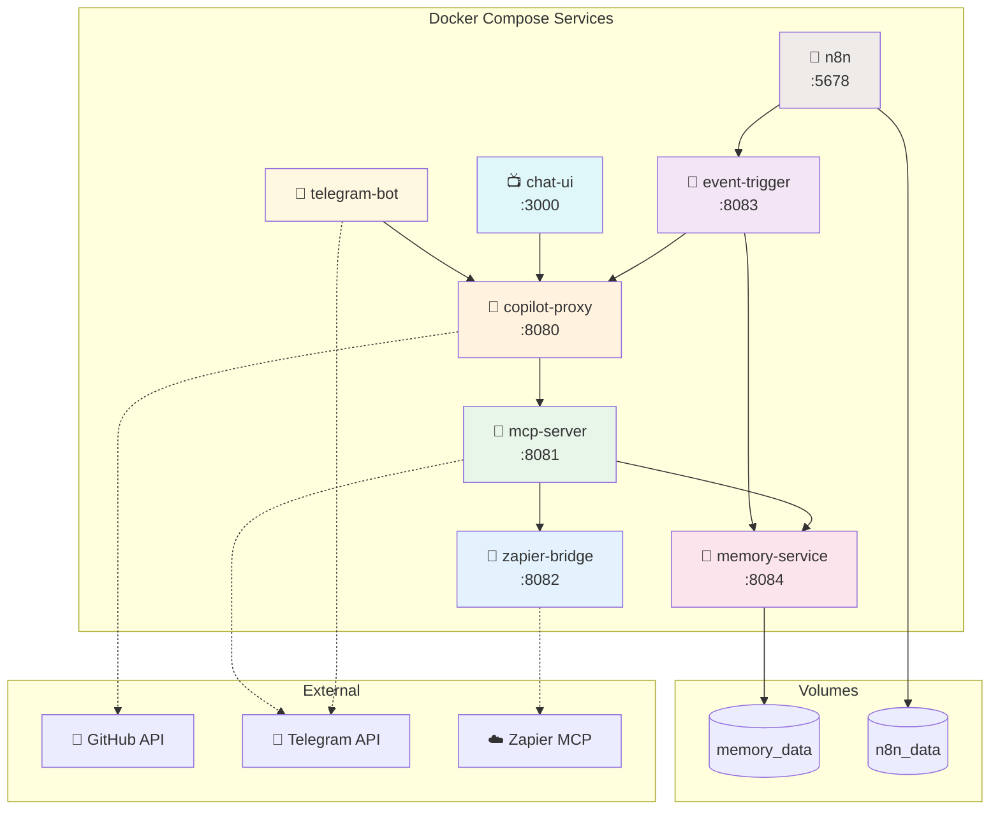

# 🏗️ Multi-Agent Copilot Chat - Architecture Complète

## 🌐 Vue d'ensemble

```mermaid
flowchart TB
    subgraph External["🌍 EXTERNAL INTERFACES"]
        Browser["🌐 Browser<br/>localhost:3000"]
        TelegramAPI["📱 Telegram API"]
        Webhooks["📨 External Webhooks<br/>(Email, Stripe, Slack, Calendar)"]
        N8N["🔌 N8N<br/>localhost:5678"]
        GithubAPI["🤖 GitHub Copilot API<br/>api.github.com"]
        ZapierMCP["☁️ Zapier MCP<br/>mcp.zapier.com"]
        TelegramBotAPI["📲 Telegram Bot API<br/>api.telegram.org"]
    end

    subgraph Docker["🐳 DOCKER NETWORK"]
        subgraph ChatUI["📺 CHAT-UI :3000"]
            ChatMain["main.py<br/>FastAPI"]
            ChatStatic["static/<br/>JS + CSS"]
            subgraph JSFiles["JavaScript Modules"]
                AppJS["app.js"]
                ArtifactJS["artifact.js"]
                SSEParser["sse-parser.js"]
                EventHandlers["event-handlers.js"]
                UIBuilders["ui-builders.js"]
                ConvJS["conversations.js"]
            end
        end

        subgraph CopilotProxy["🧠 COPILOT-PROXY :8080"]
            Routes["routes.py<br/>/v1/chat/completions"]
            Copilot["copilot.py<br/>Token Auth"]
            MCPClient["mcp_client.py<br/>Tool Calls"]
            Prompts["prompts.py<br/>System Prompt"]
            Streaming["streaming.py<br/>SSE Format"]
            subgraph Agentic["AGENTIC LOOP"]
                Loop["loop.py<br/>Max 15 iterations"]
                ToolProcessor["tool_processor.py"]
                Realtime["realtime.py<br/>Streaming deltas"]
                CopilotStream["copilot_stream.py"]
            end
        end

        subgraph MCPServer["🔧 MCP-SERVER :8081"]
            MCPMain["main.py<br/>FastAPI"]
            ZapierBridgeClient["zapier_bridge.py"]
            subgraph Tools["🔧 TOOLS PLUGINS (23)"]
                subgraph CommTools["Communication"]
                    Think["think.py<br/>💭 Reasoning"]
                    SendMsg["send_message.py<br/>💬 Text"]
                    SendTelegram["send_telegram.py<br/>📱 Notify"]
                    TaskComplete["task_complete.py<br/>✅ Terminal"]
                end
                subgraph ArtifactTools["Artifacts"]
                    CreateArtifact["create_artifact.py<br/>📄 HTML/MD/Code"]
                    EditArtifact["edit_artifact.py"]
                    GetArtifact["get_artifact.py"]
                    ReplaceArtifact["replace_in_artifact.py"]
                    BatchEdit["batch_edit_artifact.py"]
                end
                subgraph MemoryTools["Memory/RAG"]
                    Remember["remember.py<br/>🧠 Store"]
                    Recall["recall.py<br/>🔍 Search"]
                    LinkEmail["link_email.py"]
                    UnlinkAccount["unlink_account.py"]
                    GetUserConfig["get_user_config.py"]
                    SetTrigger["set_trigger.py"]
                end
                subgraph UtilTools["Utilities"]
                    SearchWeb["search_web.py<br/>🌐"]
                    GetWeather["get_weather.py<br/>🌤️"]
                    GetTime["get_current_time.py<br/>⏰"]
                    Calculate["calculate.py<br/>🧮"]
                    ConvertUnits["convert_units.py"]
                    GenRandom["generate_random.py"]
                    RunCommand["run_command.py<br/>💻"]
                    Summarize["summarize_conversation.py"]
                end
            end
        end

        subgraph ZapierBridge["🔗 ZAPIER-BRIDGE :8082"]
            ZBMain["main.py<br/>FastAPI"]
            ZapierClient["zapier_client.py<br/>FastMCP Transport"]
        end

        subgraph EventTrigger["🎯 EVENT-TRIGGER :8083"]
            ETMain["main.py<br/>FastAPI"]
            EventProcessor["event_processor.py<br/>Process & Route"]
            subgraph Sources["📦 SOURCES PLUGINS (6)"]
                EmailSource["email.py<br/>📧 Gmail/Outlook"]
                SlackSource["slack.py<br/>💬 Slack"]
                StripeSource["stripe.py<br/>💳 Payments"]
                CalendarSource["calendar.py<br/>📅 Events"]
                FormSource["form.py<br/>📝 Forms"]
                GenericSource["generic.py<br/>🔄 Fallback"]
            end
        end

        subgraph MemoryService["💾 MEMORY-SERVICE :8084"]
            MSMain["main.py<br/>FastAPI"]
            MSRoutes["routes.py<br/>REST API"]
            MSModels["models.py<br/>SQLite"]
            subgraph Database["🗄️ SQLite Database"]
                UsersTable["users<br/>telegram_chat_id"]
                LinkedAccounts["linked_accounts<br/>email, slack, etc."]
                TriggerConfigs["trigger_configs<br/>source settings"]
                Memories["memories<br/>RAG storage"]
                Conversations["conversations<br/>history"]
            end
        end

        subgraph TelegramBot["📱 TELEGRAM-BOT"]
            TBMain["main.py<br/>Polling"]
            TBHandlers["handlers.py<br/>Commands"]
            TBCopilotClient["copilot_client.py<br/>API Client"]
            TBMemoryClient["memory_client.py"]
            TBConversations["conversations.py<br/>Local State"]
        end
    end

    %% External Connections
    Browser -->|"HTTP/SSE"| ChatUI
    TelegramAPI -->|"Long Polling"| TelegramBot
    Webhooks -->|"POST /webhook/{source}"| EventTrigger
    N8N -->|"Webhooks"| EventTrigger
    
    %% Chat-UI Flow
    ChatMain --> ChatStatic
    ChatStatic --> JSFiles
    ChatMain -->|"POST /api/chat"| Routes

    %% Copilot-Proxy Internal
    Routes --> Copilot
    Routes --> MCPClient
    Routes --> Prompts
    Routes --> Streaming
    Routes --> Loop
    Copilot -->|"Token Request"| GithubAPI
    Loop --> CopilotStream
    Loop --> ToolProcessor
    CopilotStream -->|"Stream Completion"| GithubAPI
    ToolProcessor --> MCPClient
    MCPClient -->|"POST /execute_batch"| MCPServer

    %% MCP-Server Internal
    MCPMain --> Tools
    MCPMain --> ZapierBridgeClient
    ZapierBridgeClient -->|"GET /tools"| ZapierBridge

    %% Tool Connections
    SendTelegram -->|"sendMessage"| TelegramBotAPI
    Remember -->|"POST /memories"| MemoryService
    Recall -->|"POST /memories/search"| MemoryService
    LinkEmail -->|"POST /accounts/link"| MemoryService
    SetTrigger -->|"POST /triggers/config"| MemoryService
    GetUserConfig -->|"GET /users"| MemoryService

    %% Zapier Bridge
    ZBMain --> ZapierClient
    ZapierClient -->|"MCP Protocol"| ZapierMCP

    %% Event Trigger Flow
    ETMain --> EventProcessor
    ETMain --> Sources
    EventProcessor -->|"POST /users/lookup-by-account"| MemoryService
    EventProcessor -->|"GET /conversations/.../recent-messages"| MemoryService
    EventProcessor -->|"POST /v1/chat/completions"| CopilotProxy

    %% Memory Service Internal
    MSMain --> MSRoutes
    MSRoutes --> MSModels
    MSModels --> Database
    UsersTable --- LinkedAccounts
    UsersTable --- TriggerConfigs
    UsersTable --- Memories
    UsersTable --- Conversations

    %% Telegram Bot Flow
    TBMain --> TBHandlers
    TBHandlers --> TBCopilotClient
    TBHandlers --> TBMemoryClient
    TBHandlers --> TBConversations
    TBCopilotClient -->|"POST /v1/chat/completions"| CopilotProxy
    TBMemoryClient -->|"REST API"| MemoryService

    %% Styling
    classDef external fill:#e1f5fe,stroke:#01579b
    classDef service fill:#fff3e0,stroke:#e65100
    classDef tool fill:#e8f5e9,stroke:#2e7d32
    classDef database fill:#fce4ec,stroke:#880e4f
    classDef plugin fill:#f3e5f5,stroke:#4a148c

    class Browser,TelegramAPI,Webhooks,N8N,GithubAPI,ZapierMCP,TelegramBotAPI external
    class ChatUI,CopilotProxy,MCPServer,ZapierBridge,EventTrigger,MemoryService,TelegramBot service
    class Think,SendMsg,SendTelegram,TaskComplete,CreateArtifact,EditArtifact,GetArtifact,ReplaceArtifact,BatchEdit,Remember,Recall,LinkEmail,UnlinkAccount,GetUserConfig,SetTrigger,SearchWeb,GetWeather,GetTime,Calculate,ConvertUnits,GenRandom,RunCommand,Summarize tool
    class UsersTable,LinkedAccounts,TriggerConfigs,Memories,Conversations database
    class EmailSource,SlackSource,StripeSource,CalendarSource,FormSource,GenericSource plugin
```



---

## 🐳 Docker Services Dependencies



---

## 📊 Résumé des Services

| Service | Port | Technologies | Rôle Principal |
|---------|------|--------------|----------------|
| **chat-ui** | 3000 | FastAPI, JS, CSS | Interface web avec artifacts |
| **copilot-proxy** | 8080 | FastAPI, httpx | Orchestration LLM + Agentic loop |
| **mcp-server** | 8081 | FastAPI | Exécution des 23 tools |
| **zapier-bridge** | 8082 | FastMCP | Pont vers Zapier MCP |
| **event-trigger** | 8083 | FastAPI | Réception webhooks externes |
| **memory-service** | 8084 | FastAPI, SQLite | Persistence & RAG |
| **telegram-bot** | - | python-telegram-bot | Bot Telegram polling |
| **n8n** | 5678 | n8n | Workflow automation |

---

## 🔐 Variables d'environnement

```bash
COPILOT_TOKEN          # GitHub Copilot authentication
TELEGRAM_BOT_TOKEN     # Telegram Bot API
TELEGRAM_DEFAULT_CHAT_ID
ZAPIER_MCP_URL         # Zapier MCP server URL
ZAPIER_MCP_SECRET
WEBHOOK_SECRET         # Event trigger auth
DEFAULT_MODEL          # gpt-4.1 (default)
ENABLED_SOURCES        # email,stripe,slack,calendar,zapier,form,custom
```
