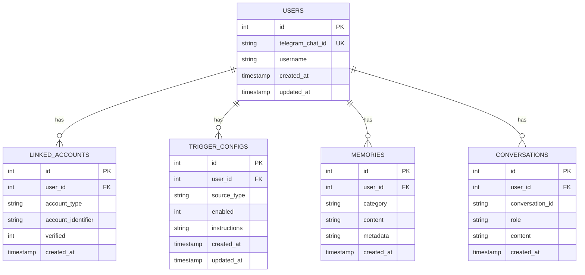
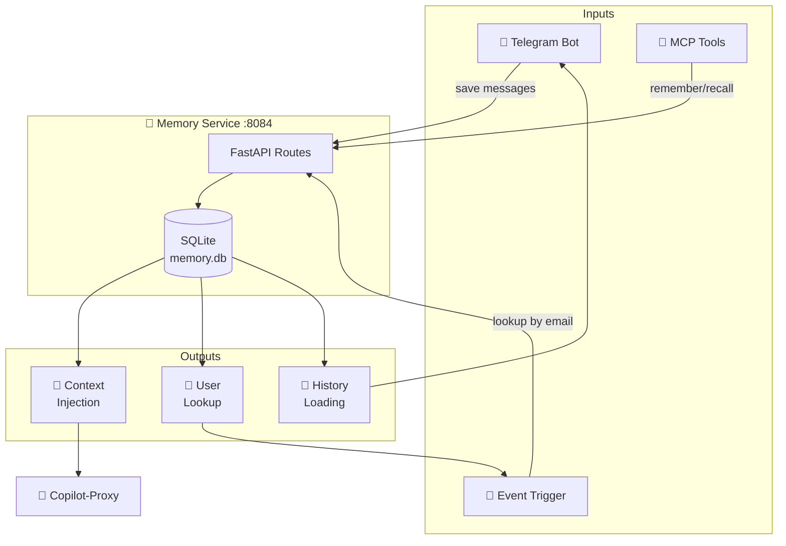

# 💾 Modèle de Données - Memory Service

## Schema Entity-Relationship



---

## Tables Détaillées

### `users`
Identité principale des utilisateurs, indexée par `telegram_chat_id`.

| Colonne | Type | Description |
|---------|------|-------------|
| `id` | INTEGER PK | ID auto-incrémenté |
| `telegram_chat_id` | TEXT UNIQUE | ID du chat Telegram |
| `username` | TEXT | Nom d'utilisateur Telegram |
| `created_at` | TIMESTAMP | Date de création |
| `updated_at` | TIMESTAMP | Date de mise à jour |

---

### `linked_accounts`
Comptes externes associés à un utilisateur (email, Slack, etc.).

| Colonne | Type | Description |
|---------|------|-------------|
| `id` | INTEGER PK | ID auto-incrémenté |
| `user_id` | INTEGER FK | Référence vers users |
| `account_type` | TEXT | Type: "email", "slack", etc. |
| `account_identifier` | TEXT | Email, Slack user ID, etc. |
| `verified` | INTEGER | 0/1 - Compte vérifié |
| `created_at` | TIMESTAMP | Date de création |

**Contrainte unique:** `(account_type, account_identifier)`

**Utilisations:**
- Lookup user par email quand un webhook email arrive
- Associer un compte Slack à un utilisateur Telegram

---

### `trigger_configs`
Configuration des notifications par source pour chaque utilisateur.

| Colonne | Type | Description |
|---------|------|-------------|
| `id` | INTEGER PK | ID auto-incrémenté |
| `user_id` | INTEGER FK | Référence vers users |
| `source_type` | TEXT | "email", "stripe", "slack", etc. |
| `enabled` | INTEGER | 0/1 - Notifications activées |
| `instructions` | TEXT | Instructions custom pour l'IA |
| `created_at` | TIMESTAMP | Date de création |
| `updated_at` | TIMESTAMP | Date de mise à jour |

**Contrainte unique:** `(user_id, source_type)`

**Exemple d'instructions:**
```
"Ne me notifie que pour les emails urgents"
"Résume les paiements Stripe brièvement"
```

---

### `memories`
Stockage de faits/préférences pour le RAG (Retrieval Augmented Generation).

| Colonne | Type | Description |
|---------|------|-------------|
| `id` | INTEGER PK | ID auto-incrémenté |
| `user_id` | INTEGER FK | Nullable - mémoire globale si NULL |
| `category` | TEXT | "general", "preference", "fact", "task", "context" |
| `content` | TEXT | Le contenu à mémoriser |
| `metadata` | TEXT | Métadonnées JSON optionnelles |
| `created_at` | TIMESTAMP | Date de création |

**Catégories:**
- `general` - Informations générales
- `preference` - Préférences utilisateur ("préfère les réponses courtes")
- `fact` - Faits ("travaille chez Company X")
- `task` - Tâches en cours
- `context` - Contexte de conversation

---

### `conversations`
Historique complet des conversations pour le contexte.

| Colonne | Type | Description |
|---------|------|-------------|
| `id` | INTEGER PK | ID auto-incrémenté |
| `user_id` | INTEGER FK | Référence vers users |
| `conversation_id` | TEXT | ID unique de conversation |
| `role` | TEXT | "user" ou "assistant" |
| `content` | TEXT | Contenu du message |
| `created_at` | TIMESTAMP | Date du message |

**Format conversation_id:** `telegram_{chat_id}` pour les conversations Telegram.

---

## API Endpoints

### Users

```
POST /users                         # Créer ou récupérer un utilisateur
GET  /users/{telegram_chat_id}      # Récupérer un utilisateur
POST /users/lookup-by-account       # Trouver user par compte lié
```

### Linked Accounts

```
POST /accounts/link                 # Associer un compte externe
POST /accounts/unlink               # Supprimer un compte lié
GET  /accounts/{telegram_chat_id}   # Liste des comptes liés
```

### Trigger Configs

```
POST /triggers/config                       # Configurer un trigger
GET  /triggers/{telegram_chat_id}           # Liste des configs
GET  /triggers/{telegram_chat_id}/{source}  # Config spécifique
```

### Memories (RAG)

```
POST /memories                      # Ajouter une mémoire
POST /memories/search               # Rechercher (LIKE query)
GET  /memories/recent               # Mémoires récentes
```

### Conversations

```
POST /conversations/message                              # Sauvegarder un message
GET  /conversations/{conversation_id}                    # Messages d'une conversation
GET  /conversations/user/{telegram_chat_id}              # Conversations d'un user
GET  /conversations/user/{telegram_chat_id}/recent-messages  # Messages récents
```

---

## Flux de Données



---

## Volume Docker

Le fichier SQLite est persisté dans un volume Docker:

```yaml
volumes:
  memory_data:  # → /app/data/memory.db
```
