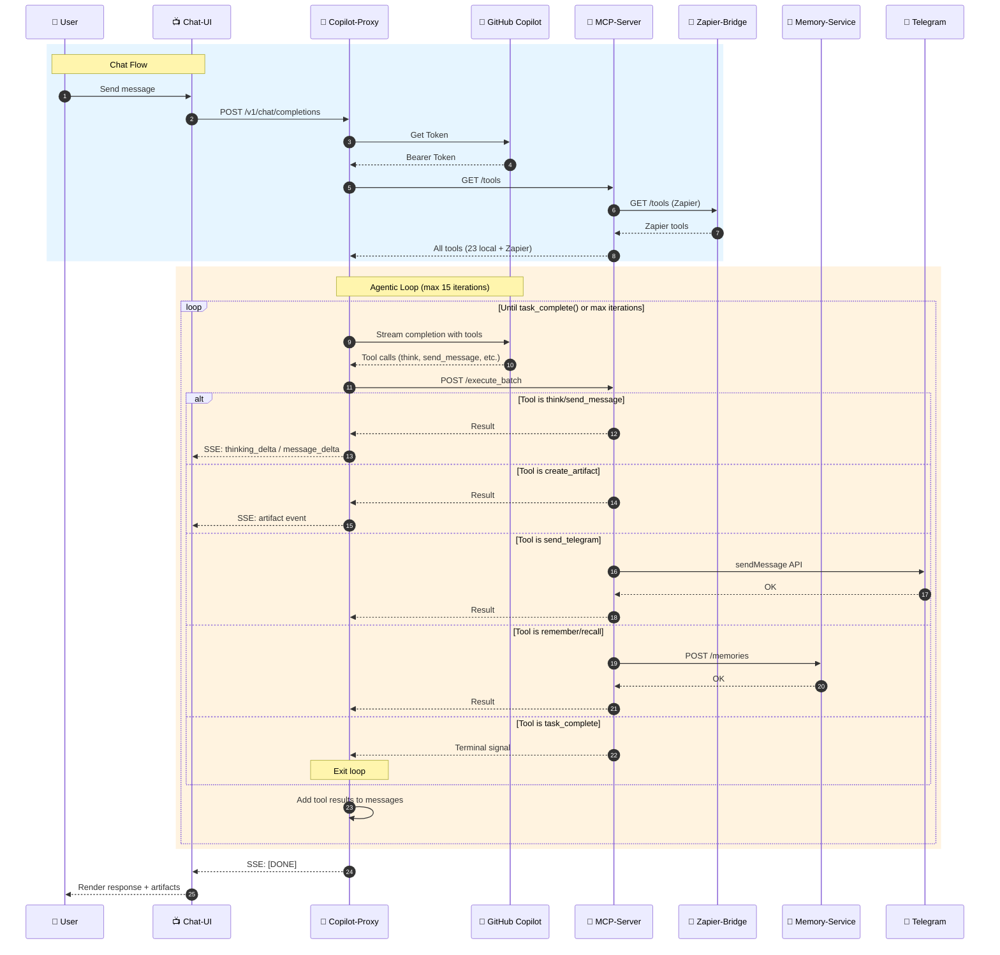
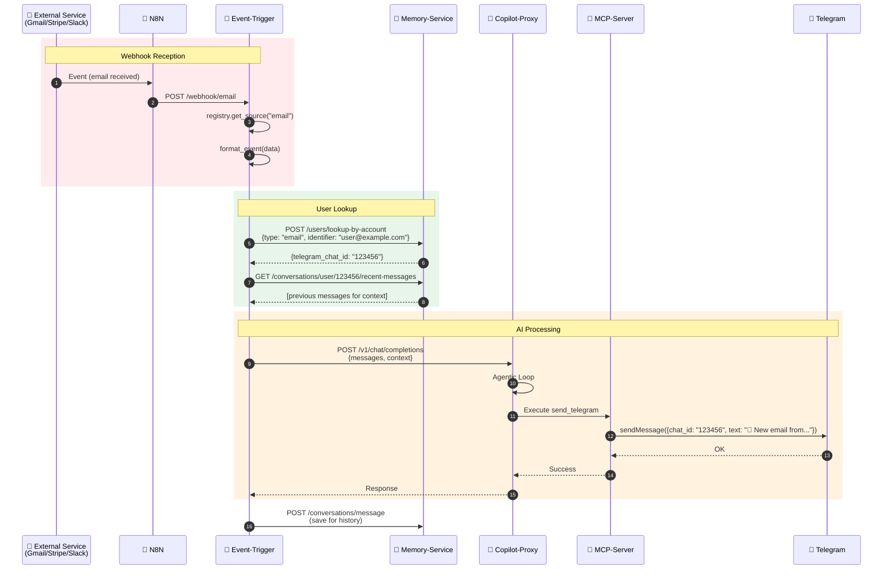
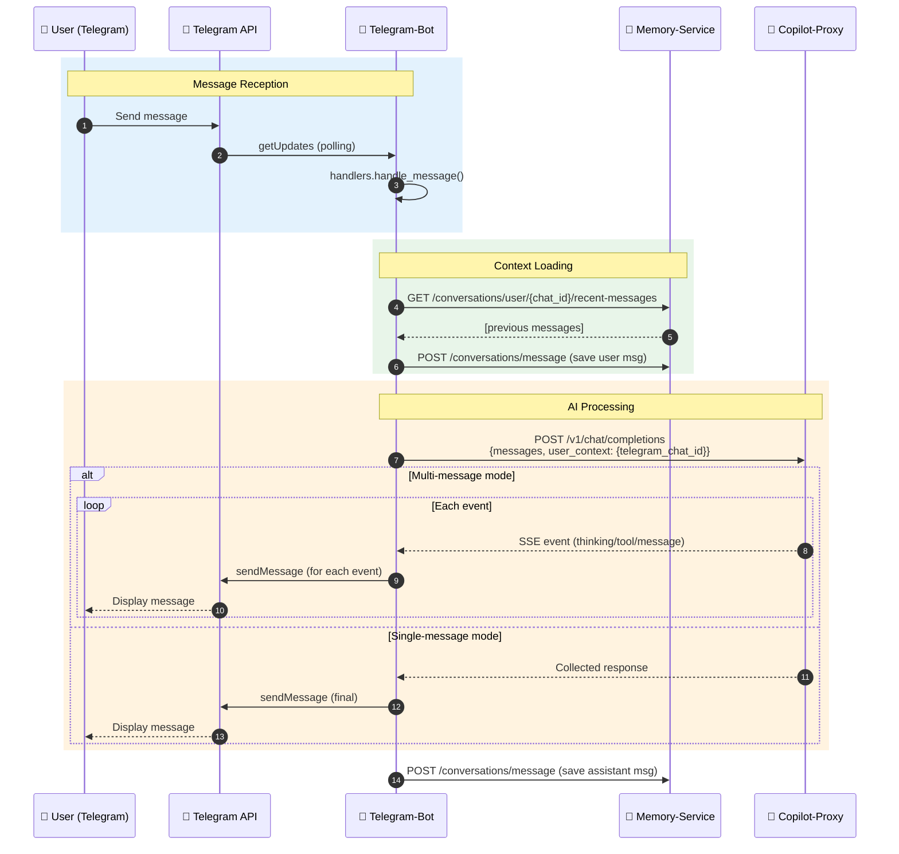
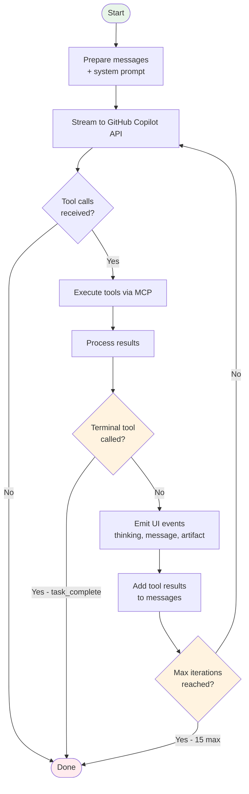
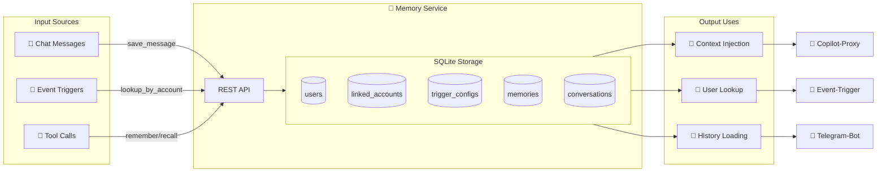

# 🔄 Flux de Données - Diagrammes Séquence

## 1️⃣ Chat Flow (Browser → AI → Response)

---

## 2️⃣ Event Trigger Flow (Webhooks → AI → Notification)

---

## 3️⃣ Telegram Bot Flow

---

## 4️⃣ Agentic Loop Detail

---

## 5️⃣ Memory & RAG Flow

