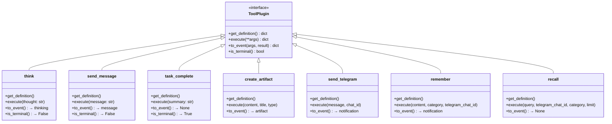
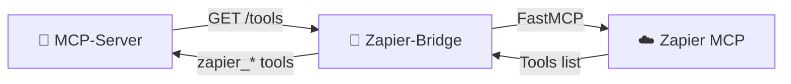

# 🔧 Système de Plugins

## MCP Tools Plugin System

Chaque fichier `.py` dans `mcp-server/tools/` est automatiquement découvert au démarrage.

### Structure d'un Plugin Tool



### Fonctions Requises

| Fonction | Requis | Description |
|----------|--------|-------------|
| `get_definition()` | ✅ Oui | Retourne le schéma OpenAI function |
| `execute(**args)` | ✅ Oui | Exécute le tool et retourne le résultat |
| `to_event(args, result)` | ❌ Optionnel | Convertit en événement UI (artifact, thinking, message) |
| `is_terminal()` | ❌ Optionnel | `True` si le tool termine la boucle agentic |

### Exemple de Plugin

```python
"""
Tool Example - Description
"""

def get_definition():
    return {
        "type": "function",
        "function": {
            "name": "my_tool",
            "description": "What this tool does",
            "parameters": {
                "type": "object",
                "properties": {
                    "param1": {
                        "type": "string",
                        "description": "Description of param1"
                    }
                },
                "required": ["param1"]
            }
        }
    }

def execute(param1: str) -> dict:
    # Do something
    return {"success": True, "result": "..."}

def to_event(args: dict, result: dict) -> dict:
    # Optional: convert to UI event
    return {
        "type": "notification",
        "content": f"Tool executed: {args['param1']}"
    }

def is_terminal() -> bool:
    return False
```

---

## Liste des Tools (23)

### 💬 Communication Tools

| Tool | Description | Terminal |
|------|-------------|----------|
| `think` | Raisonnement step-by-step (affiché dans bloc dépliable) | ❌ |
| `send_message` | Envoyer un message texte à l'utilisateur | ❌ |
| `send_telegram` | Envoyer une notification Telegram | ❌ |
| `task_complete` | Signaler que la tâche est terminée | ✅ |

### 📄 Artifact Tools

| Tool | Description | UI Event |
|------|-------------|----------|
| `create_artifact` | Créer un artefact HTML/MD/Code | `artifact` |
| `edit_artifact` | (deprecated) | - |
| `get_artifact` | Récupérer le contenu d'un artefact | - |
| `replace_in_artifact` | Modifier par find & replace | `artifact_edit` |
| `batch_edit_artifact` | Modifications multiples | `artifact_edit` |

### 🧠 Memory/RAG Tools

| Tool | Description | Service |
|------|-------------|---------|
| `remember` | Stocker une information | memory-service |
| `recall` | Rechercher dans les mémoires | memory-service |
| `link_email` | Associer un email à un utilisateur | memory-service |
| `unlink_account` | Supprimer un compte lié | memory-service |
| `get_user_config` | Récupérer les préférences | memory-service |
| `set_trigger` | Configurer les notifications | memory-service |

### 🛠️ Utility Tools

| Tool | Description |
|------|-------------|
| `search_web` | Recherche web |
| `get_weather` | Météo |
| `get_current_time` | Heure actuelle |
| `calculate` | Calculs mathématiques |
| `convert_units` | Conversion d'unités |
| `generate_random` | Nombres/chaînes aléatoires |
| `run_command` | Exécuter une commande shell |
| `summarize_conversation` | Résumer une longue conversation |

---

## Event Sources Plugin System

Chaque fichier `.py` dans `event-trigger/sources/` est automatiquement découvert.

### Structure d'un Plugin Source

```python
"""
Source Plugin Example
"""

def get_definition() -> dict:
    return {
        "name": "my_source",
        "description": "Description",
        "endpoint": "/webhook/my_source",
        "expected_fields": ["field1", "field2"]
    }

def get_instructions() -> str:
    """Instructions pour l'IA"""
    return """Tu es un assistant qui traite les événements my_source.
    Analyse l'événement et notifie l'utilisateur via Telegram."""

def format_event(data: dict) -> str:
    """Formatte les données pour l'IA"""
    return f"""## Événement reçu
    Field1: {data.get('field1')}
    Field2: {data.get('field2')}
    """

def get_routes(app):
    """Optionnel: routes personnalisées"""
    pass
```

### Sources Disponibles (6)

| Source | Endpoint | Description |
|--------|----------|-------------|
| `email` | `/webhook/email` | Gmail, Outlook, IMAP |
| `slack` | `/webhook/slack` | Messages Slack |
| `stripe` | `/webhook/stripe` | Paiements |
| `calendar` | `/webhook/calendar` | Événements calendrier |
| `form` | `/webhook/form` | Soumissions de formulaires |
| `generic` | `/webhook/generic` | Fallback pour sources inconnues |

---

## Zapier Tools (Dynamic)

Les tools Zapier sont chargés dynamiquement depuis `mcp.zapier.com` via le `zapier-bridge`.



Les tools Zapier ont le préfixe `zapier_` pour les distinguer des tools locaux.
