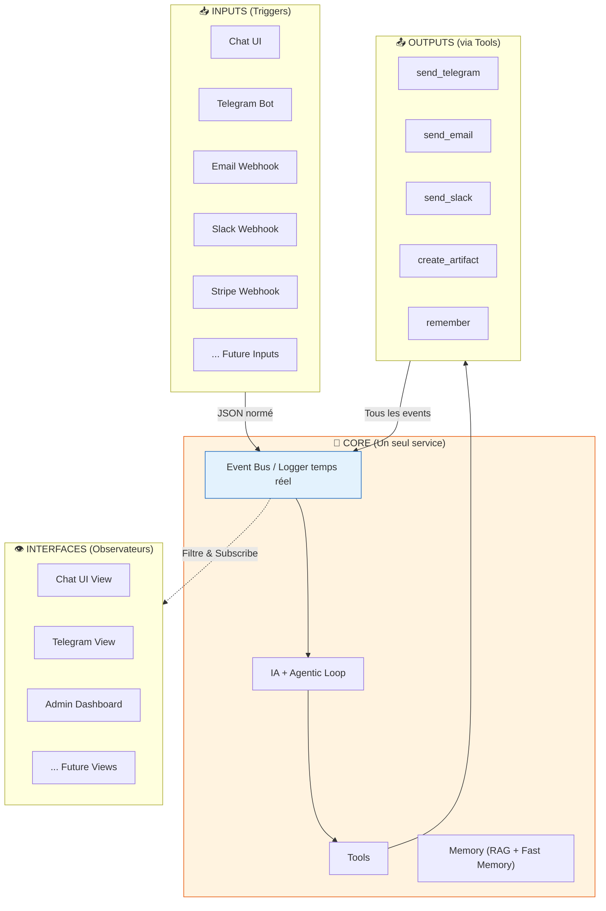

# 🎯 Vision Originale - Architecture Simplifiée

## Résumé de ta vision

Tu veux passer de **8 services** à une architecture **ultra-simple** avec 3 concepts:

```
INPUT → IA → OUTPUT (logs) → INTERFACES (observent les logs)
```

---

## 🏗️ Architecture Proposée



---

## 📊 Concepts Clés

### 1. Event Bus / Logger Temps Réel

Tout passe par un **bus d'événements central**:
- Chaque input génère un event
- Chaque tool génère un event
- Chaque output génère un event

```json
{
  "id": "evt_123",
  "timestamp": "2025-12-03T10:00:00Z",
  "type": "trigger|tool_call|tool_result|message|artifact",
  "source": "telegram|chat_ui|email_webhook|...",
  "session_id": "sess_abc",
  "user_id": "user_123",
  "data": { ... },
  "tags": ["show_telegram", "show_chat_ui"]
}
```

### 2. Interfaces = Observateurs

Les interfaces **ne font que regarder** les logs:

```python
# Telegram Bot
async for event in event_bus.subscribe(filter=lambda e: 
    "show_telegram" in e.tags and e.user_id == user_id
):
    await send_telegram_message(event)

# Chat UI
async for event in event_bus.subscribe(filter=lambda e:
    e.session_id == current_session
):
    yield sse_event(event)
```

### 3. Memory Simplifiée

```
┌─────────────────────────────────────────────────────┐
│                    MEMORY                           │
├─────────────────────────────────────────────────────┤
│  FAST MEMORY (toujours en contexte)                │
│  - Résumé des infos importantes                     │
│  - Préférences utilisateur                          │
│  - Contexte courant                                 │
│  - ~500 tokens max                                  │
├─────────────────────────────────────────────────────┤
│  DATABASE (RAG - recherche quand besoin)           │
│  - Tout l'historique                                │
│  - Tous les faits                                   │
│  - Toutes les conversations                         │
│  - Recherche vectorielle                            │
└─────────────────────────────────────────────────────┘
```

### 4. Config Simple pour Linked Accounts

```yaml
# config/users.yaml
users:
  - telegram_chat_id: "123456"
    email: "user@example.com"
    slack_id: "U123ABC"
    preferences:
      notifications: true
      language: "fr"
```

---

## 📋 Format JSON Normé pour Triggers

```json
{
  "trigger_type": "telegram|chat_ui|email|slack|stripe|calendar",
  "model": "gpt-4.1",
  "user_id": "123456",
  "session_id": "sess_abc",
  "message": {
    "role": "user",
    "content": "..."
  },
  "context": {
    "source_specific_data": {}
  },
  "response_targets": ["telegram", "chat_ui"]
}
```

---

## ✅ Avantages

1. **Ultra simple** - Un seul service core
2. **Extensible** - Ajouter un input/output = ajouter un subscriber
3. **Découplé** - Les interfaces ne connaissent pas l'IA
4. **Observable** - Tout est loggé, debugging facile
5. **Flexible** - Un message peut aller à plusieurs interfaces

---

## ❌ Problèmes à Résoudre

1. **État de session** - Comment savoir que la réponse va au bon endroit?
2. **Performance** - Un event bus peut devenir un bottleneck
3. **Persistence des logs** - Combien de temps garder?
4. **Sécurité** - Qui peut voir quoi dans les logs?
5. **Complexité cachée** - Le service "core" devient gros
