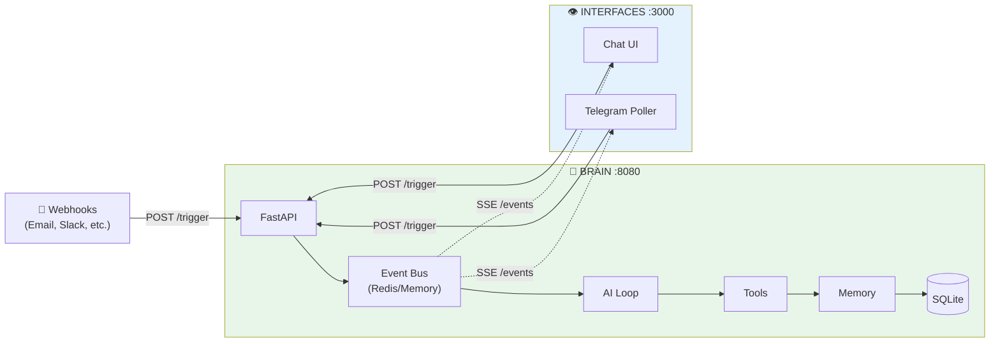

# 💡 Proposition A: Ultra-Simple (2 Services)

## Concept

Le **minimum absolu** pour que ça marche.

```
┌─────────────────┐     ┌─────────────────┐
│   BRAIN         │     │   INTERFACES    │
│   (FastAPI)     │◄───►│   (Optionnel)   │
│                 │     │                 │
│ - Event Bus     │     │ - Chat UI       │
│ - AI + Tools    │     │ - Telegram Bot  │
│ - Memory        │     │ - Admin         │
│ - Webhooks      │     │                 │
└─────────────────┘     └─────────────────┘
      :8080                  :3000
```

---

## Architecture



---

## Code Structure

```
brain/
├── main.py              # FastAPI app
├── event_bus.py         # In-memory pub/sub
├── ai_loop.py           # Agentic loop
├── memory.py            # Fast + RAG
├── config.py            # Users, settings
├── tools/
│   ├── __init__.py
│   ├── think.py
│   ├── send_message.py
│   ├── send_telegram.py
│   ├── remember.py
│   └── ...
└── db/
    └── store.py         # SQLite single table

interfaces/
├── main.py              # FastAPI (sert Chat UI)
├── telegram_poller.py   # Long polling Telegram
├── static/
└── templates/
```

---

## API du Brain

```python
# POST /trigger - Point d'entrée unique
{
    "source": "telegram|chat_ui|email|slack|...",
    "user_id": "123",
    "session_id": "sess_abc",
    "model": "gpt-4.1",
    "message": "Hello!",
    "context": {},
    "response_to": ["telegram", "chat_ui"]  # Où envoyer les réponses
}

# GET /events?session_id=xxx - SSE stream
# Retourne tous les events de cette session

# GET /memory/fast/{user_id} - Fast memory
# GET /memory/search?q=xxx - RAG search
```

---

## Database: UNE SEULE TABLE

```sql
CREATE TABLE store (
    id TEXT PRIMARY KEY,
    type TEXT NOT NULL,      -- "event", "memory", "user", "config"
    user_id TEXT,
    session_id TEXT,
    data JSON NOT NULL,
    tags TEXT,               -- JSON array pour filtrage
    created_at TIMESTAMP DEFAULT CURRENT_TIMESTAMP,
    
    -- Index pour recherche
    INDEX idx_type (type),
    INDEX idx_user (user_id),
    INDEX idx_session (session_id),
    INDEX idx_created (created_at)
);
```

Exemples:
```json
// Event
{"id": "evt_1", "type": "event", "user_id": "123", "session_id": "s1", 
 "data": {"event_type": "message", "content": "Hello"}, "tags": ["telegram"]}

// Memory
{"id": "mem_1", "type": "memory", "user_id": "123", 
 "data": {"category": "preference", "content": "Préfère les réponses courtes"}}

// User config
{"id": "usr_123", "type": "user", "user_id": "123",
 "data": {"telegram_chat_id": "123", "email": "user@example.com"}}
```

---

## Fast Memory

```python
# memory.py
class Memory:
    def __init__(self):
        self.fast_cache = {}  # user_id -> summary string
    
    def get_fast_memory(self, user_id: str) -> str:
        """Retourne le résumé toujours inclus dans le prompt"""
        if user_id not in self.fast_cache:
            self.fast_cache[user_id] = self._build_summary(user_id)
        return self.fast_cache[user_id]
    
    def _build_summary(self, user_id: str) -> str:
        """Construit un résumé des infos importantes"""
        # Récupère les dernières memories importantes
        # Limite à ~500 tokens
        pass
    
    def search(self, query: str, user_id: str = None) -> list:
        """RAG search dans la DB"""
        pass
    
    def invalidate(self, user_id: str):
        """Appelé quand on ajoute une memory importante"""
        self.fast_cache.pop(user_id, None)
```

---

## Event Bus Simple

```python
# event_bus.py
import asyncio
from collections import defaultdict

class EventBus:
    def __init__(self):
        self.subscribers = defaultdict(list)  # session_id -> [queues]
    
    async def emit(self, event: dict):
        """Émet un event à tous les subscribers de la session"""
        session_id = event.get("session_id")
        for queue in self.subscribers[session_id]:
            await queue.put(event)
        
        # Persiste dans la DB
        await self.store(event)
    
    async def subscribe(self, session_id: str):
        """Retourne un async generator d'events"""
        queue = asyncio.Queue()
        self.subscribers[session_id].append(queue)
        try:
            while True:
                event = await queue.get()
                yield event
        finally:
            self.subscribers[session_id].remove(queue)
```

---

## Avantages

| Aspect | Avant (8 services) | Après (2 services) |
|--------|-------------------|-------------------|
| Containers | 8 | 2 |
| Ports | 8 | 2 |
| Complexité | Haute | Basse |
| Debugging | Difficile | Facile |
| Deployment | Complexe | Simple |
| Memory usage | ~2GB | ~500MB |

---

## Inconvénients

1. **Moins de séparation** - Tout dans le même process
2. **Scaling limité** - Un seul serveur
3. **Single point of failure** - Si brain crash, tout crash

---

## Quand utiliser?

✅ Projet personnel / POC
✅ < 100 utilisateurs
✅ Déploiement simple (1 serveur)
❌ Production à grande échelle
❌ Haute disponibilité requise
