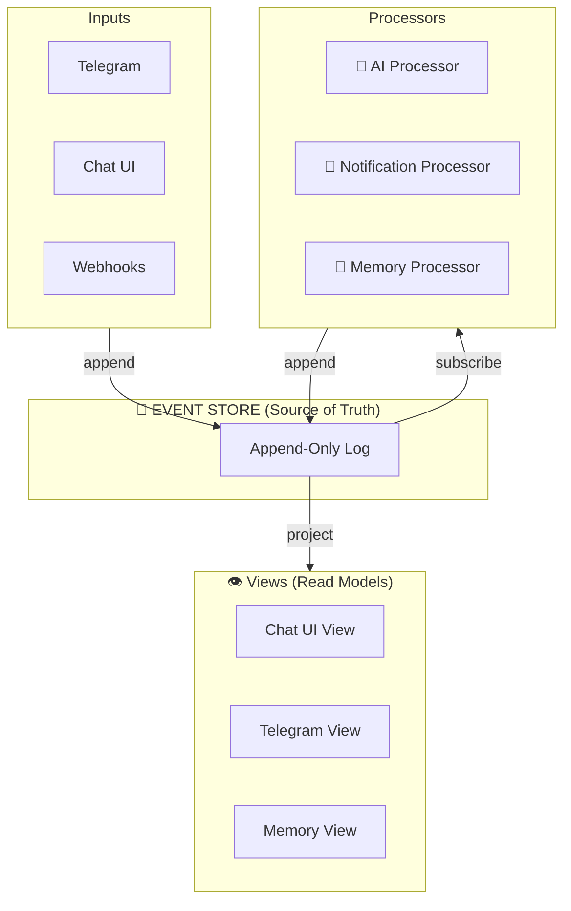
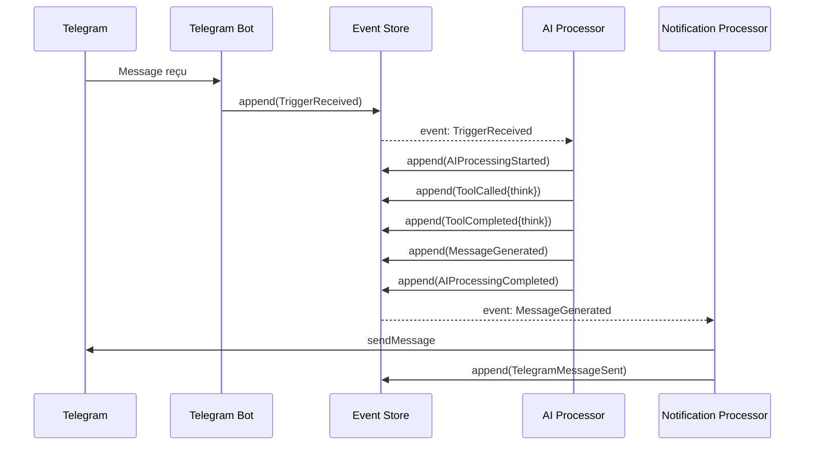

# 💡 Proposition B: Event Sourcing Pur

## Concept

**Tout est event.** L'état est reconstruit à partir des events.



---

## Pourquoi Event Sourcing?

1. **Audit trail complet** - On sait exactement ce qui s'est passé
2. **Time travel** - On peut reconstruire l'état à n'importe quel moment
3. **Découplage total** - Chaque processor est indépendant
4. **Scalable** - Les processors peuvent être distribués

---

## Structure des Events

```typescript
interface Event {
    id: string;
    timestamp: string;
    type: string;
    aggregate_id: string;  // user_id ou session_id
    data: any;
    metadata: {
        source: string;
        causation_id?: string;  // Event qui a causé celui-ci
        correlation_id: string;  // Pour tracer une chaîne
    };
}
```

### Types d'Events

```yaml
# Inputs
- TriggerReceived
- MessageReceived
- WebhookReceived

# AI Processing
- AIProcessingStarted
- ToolCalled
- ToolCompleted
- ThinkingGenerated
- MessageGenerated
- AIProcessingCompleted

# Outputs
- TelegramMessageSent
- EmailSent
- ArtifactCreated

# Memory
- MemoryStored
- MemoryRecalled
- FastMemoryUpdated
```

---

## Architecture

```
event-store/
├── main.py              # FastAPI - API pour append/read
├── store.py             # Append-only log (SQLite/PostgreSQL)
└── projections.py       # Read models

ai-processor/
├── main.py              # Consomme events, appelle IA
├── tools/               # Tools
└── loop.py              # Agentic loop

notification-processor/
├── main.py              # Consomme events, envoie notifications
├── telegram.py
├── email.py
└── slack.py

memory-processor/
├── main.py              # Consomme events, met à jour memory
├── fast_memory.py       # Cache en mémoire
└── rag.py               # Recherche vectorielle

interfaces/
├── chat-ui/             # SSE depuis event-store
└── telegram-bot/        # Polling + SSE
```

---

## Event Store API

```python
# POST /events - Append un event
{
    "type": "MessageReceived",
    "aggregate_id": "user_123",
    "data": {"content": "Hello"},
    "metadata": {"source": "telegram"}
}

# GET /events?after=evt_123&type=Message* - Read events
# GET /events/stream?aggregate_id=user_123 - SSE stream
# GET /projections/conversation/{session_id} - Read model
```

---

## Database Schema

```sql
-- Events (append-only, jamais modifié)
CREATE TABLE events (
    id TEXT PRIMARY KEY,
    timestamp TIMESTAMP NOT NULL,
    type TEXT NOT NULL,
    aggregate_id TEXT NOT NULL,
    data JSON NOT NULL,
    metadata JSON NOT NULL,
    
    INDEX idx_aggregate (aggregate_id, timestamp),
    INDEX idx_type (type)
);

-- Projections (read models, reconstruisables)
CREATE TABLE projections (
    id TEXT PRIMARY KEY,
    type TEXT NOT NULL,
    data JSON NOT NULL,
    last_event_id TEXT,
    updated_at TIMESTAMP
);
```

---

## Flow Exemple: Message Telegram



---

## Fast Memory avec Projections

```python
# memory-processor/fast_memory.py

class FastMemoryProjection:
    """Projection qui maintient un résumé par user"""
    
    async def handle(self, event):
        if event.type == "MemoryStored":
            await self.update_summary(event.aggregate_id)
        elif event.type == "MessageGenerated":
            # Peut extraire des infos importantes
            pass
    
    async def update_summary(self, user_id: str):
        # Récupère les N dernières memories importantes
        # Génère un résumé (~500 tokens)
        # Stocke dans projection
        pass
    
    async def get_summary(self, user_id: str) -> str:
        projection = await db.get_projection(f"fast_memory:{user_id}")
        return projection.data["summary"]
```

---

## Avantages

| Aspect | Score |
|--------|-------|
| Scalabilité | ⭐⭐⭐⭐⭐ |
| Auditabilité | ⭐⭐⭐⭐⭐ |
| Découplage | ⭐⭐⭐⭐⭐ |
| Simplicité | ⭐⭐ |
| Performance | ⭐⭐⭐⭐ |

---

## Inconvénients

1. **Complexité conceptuelle** - Event sourcing demande un changement de mindset
2. **Eventual consistency** - Les read models peuvent être en retard
3. **Plus de services** - 4 processors + 1 store = 5 containers
4. **Debugging** - Suivre une chaîne d'events peut être complexe

---

## Quand utiliser?

✅ Besoin d'audit trail complet
✅ Système distribué
✅ Haute disponibilité requise
✅ Équipe familière avec event sourcing
❌ Prototype rapide
❌ Équipe petite
