# 💡 Proposition C: Monolithe Modulaire

## Concept

**Un seul service**, mais avec des **modules bien séparés** et un **event bus interne**.

Le meilleur des deux mondes: simplicité du monolithe + découplage des microservices.

```mermaid
flowchart TB
    subgraph Container["🐳 UN SEUL CONTAINER"]
        subgraph API["FastAPI"]
            TriggerAPI["/trigger"]
            EventsAPI["/events (SSE)"]
            MemoryAPI["/memory"]
        end
        
        subgraph Core["Core"]
            EventBus["Event Bus (in-memory)"]
            AILoop["AI Loop"]
            ToolRunner["Tool Runner"]
        end
        
        subgraph Modules["Modules (Plugins)"]
            MemoryMod["Memory Module"]
            TelegramMod["Telegram Module"]
            EmailMod["Email Module"]
        end
        
        subgraph Storage["Storage"]
            DB[(SQLite)]
            Cache["Fast Cache"]
        end
    end
    
    API --> EventBus
    EventBus --> Core
    Core --> Modules
    Modules --> Storage
    EventBus -.-> API
```



---

## Architecture Fichiers

```
brain/
├── main.py                 # FastAPI app
├── config.py               # Configuration
│
├── core/
│   ├── __init__.py
│   ├── event_bus.py        # Pub/Sub interne
│   ├── ai_loop.py          # Boucle agentic
│   └── tool_runner.py      # Exécution tools
│
├── modules/
│   ├── __init__.py         # Auto-discovery
│   ├── memory/
│   │   ├── __init__.py
│   │   ├── fast.py         # Fast memory (cache)
│   │   ├── rag.py          # Recherche
│   │   └── store.py        # Persistence
│   ├── telegram/
│   │   ├── __init__.py
│   │   ├── sender.py       # Envoie messages
│   │   └── poller.py       # Reçoit messages (optionnel)
│   ├── email/
│   │   └── ...
│   └── chat_ui/
│       └── ...
│
├── tools/
│   ├── __init__.py         # Auto-discovery
│   ├── think.py
│   ├── send_message.py
│   ├── remember.py
│   └── ...
│
├── api/
│   ├── __init__.py
│   ├── trigger.py          # POST /trigger
│   ├── events.py           # GET /events (SSE)
│   └── memory.py           # GET/POST /memory
│
└── storage/
    ├── __init__.py
    ├── database.py         # SQLite wrapper
    └── cache.py            # In-memory cache
```

---

## Module Interface

Chaque module implémente une interface simple:

```python
# modules/base.py
class Module:
    name: str
    
    async def setup(self, event_bus):
        """Appelé au démarrage"""
        pass
    
    async def handle_event(self, event: dict):
        """Appelé pour chaque event pertinent"""
        pass
    
    def get_tools(self) -> list:
        """Retourne les tools fournis par ce module"""
        return []
```

### Exemple: Module Telegram

```python
# modules/telegram/__init__.py
from .sender import send_message
from .poller import start_polling

class TelegramModule(Module):
    name = "telegram"
    
    async def setup(self, event_bus):
        self.event_bus = event_bus
        self.bot = TelegramBot(config.TELEGRAM_TOKEN)
        
        # Démarre le polling en background
        asyncio.create_task(self._poll_loop())
    
    async def handle_event(self, event: dict):
        if event["type"] == "send_telegram":
            await send_message(
                self.bot,
                event["data"]["chat_id"],
                event["data"]["message"]
            )
    
    async def _poll_loop(self):
        async for update in self.bot.poll():
            await self.event_bus.emit({
                "type": "trigger",
                "source": "telegram",
                "data": update
            })
    
    def get_tools(self):
        return [send_telegram_tool]
```

---

## Event Bus Interne

```python
# core/event_bus.py
import asyncio
from typing import Callable, Dict, List
from collections import defaultdict

class EventBus:
    def __init__(self):
        self.handlers: Dict[str, List[Callable]] = defaultdict(list)
        self.subscribers: Dict[str, List[asyncio.Queue]] = defaultdict(list)
        self.history: List[dict] = []  # Pour debugging
    
    def on(self, event_type: str, handler: Callable):
        """Enregistre un handler pour un type d'event"""
        self.handlers[event_type].append(handler)
    
    async def emit(self, event: dict):
        """Émet un event"""
        event_type = event.get("type", "*")
        
        # Persist
        await self._persist(event)
        
        # Notify handlers
        for handler in self.handlers[event_type] + self.handlers["*"]:
            asyncio.create_task(handler(event))
        
        # Notify SSE subscribers
        session_id = event.get("session_id")
        if session_id:
            for queue in self.subscribers[session_id]:
                await queue.put(event)
    
    async def subscribe(self, session_id: str):
        """Subscribe aux events d'une session (pour SSE)"""
        queue = asyncio.Queue()
        self.subscribers[session_id].append(queue)
        try:
            while True:
                yield await queue.get()
        finally:
            self.subscribers[session_id].remove(queue)
```

---

## Database: Une Table + Indices

```python
# storage/database.py
import aiosqlite
import json

class Database:
    async def init(self):
        async with aiosqlite.connect("brain.db") as db:
            await db.execute("""
                CREATE TABLE IF NOT EXISTS store (
                    id TEXT PRIMARY KEY,
                    type TEXT NOT NULL,
                    user_id TEXT,
                    session_id TEXT,
                    data TEXT NOT NULL,
                    created_at TIMESTAMP DEFAULT CURRENT_TIMESTAMP
                )
            """)
            await db.execute("CREATE INDEX IF NOT EXISTS idx_type ON store(type)")
            await db.execute("CREATE INDEX IF NOT EXISTS idx_user ON store(user_id)")
            await db.execute("CREATE INDEX IF NOT EXISTS idx_session ON store(session_id)")
    
    async def insert(self, type: str, data: dict, user_id: str = None, session_id: str = None):
        id = f"{type}_{uuid4().hex[:8]}"
        async with aiosqlite.connect("brain.db") as db:
            await db.execute(
                "INSERT INTO store (id, type, user_id, session_id, data) VALUES (?, ?, ?, ?, ?)",
                (id, type, user_id, session_id, json.dumps(data))
            )
            await db.commit()
        return id
    
    async def search(self, type: str = None, user_id: str = None, query: str = None, limit: int = 100):
        sql = "SELECT * FROM store WHERE 1=1"
        params = []
        if type:
            sql += " AND type = ?"
            params.append(type)
        if user_id:
            sql += " AND user_id = ?"
            params.append(user_id)
        if query:
            sql += " AND data LIKE ?"
            params.append(f"%{query}%")
        sql += f" ORDER BY created_at DESC LIMIT {limit}"
        
        async with aiosqlite.connect("brain.db") as db:
            db.row_factory = aiosqlite.Row
            async with db.execute(sql, params) as cursor:
                return [dict(row) async for row in cursor]
```

---

## Fast Memory

```python
# modules/memory/fast.py
from functools import lru_cache

class FastMemory:
    def __init__(self, db: Database, max_tokens: int = 500):
        self.db = db
        self.max_tokens = max_tokens
        self._cache: Dict[str, str] = {}
    
    async def get(self, user_id: str) -> str:
        """Retourne le résumé fast memory pour un user"""
        if user_id not in self._cache:
            self._cache[user_id] = await self._build(user_id)
        return self._cache[user_id]
    
    async def _build(self, user_id: str) -> str:
        """Construit le résumé"""
        # Récupère config user
        user = await self.db.search(type="user", user_id=user_id, limit=1)
        
        # Récupère memories importantes
        memories = await self.db.search(type="memory", user_id=user_id, limit=10)
        
        # Construit le résumé
        parts = []
        if user:
            parts.append(f"User: {user[0]['data']}")
        for m in memories:
            parts.append(f"- {m['data']['content']}")
        
        return "\n".join(parts)[:self.max_tokens * 4]  # ~4 chars/token
    
    def invalidate(self, user_id: str):
        """Invalide le cache quand on ajoute une memory"""
        self._cache.pop(user_id, None)
```

---

## API Endpoints

```python
# api/trigger.py
@router.post("/trigger")
async def trigger(request: TriggerRequest, event_bus: EventBus = Depends()):
    """Point d'entrée unique pour tous les triggers"""
    event = {
        "id": f"evt_{uuid4().hex[:8]}",
        "type": "trigger",
        "source": request.source,
        "user_id": request.user_id,
        "session_id": request.session_id or f"{request.source}_{request.user_id}_{int(time.time())}",
        "data": {
            "message": request.message,
            "model": request.model,
            "context": request.context
        }
    }
    await event_bus.emit(event)
    return {"session_id": event["session_id"]}

# api/events.py
@router.get("/events/{session_id}")
async def events(session_id: str, event_bus: EventBus = Depends()):
    """SSE stream des events d'une session"""
    async def generate():
        async for event in event_bus.subscribe(session_id):
            yield f"data: {json.dumps(event)}\n\n"
    return StreamingResponse(generate(), media_type="text/event-stream")
```

---

## docker-compose.yml Final

```yaml
version: '3.8'

services:
  brain:
    build: ./brain
    ports:
      - "8080:8080"
    volumes:
      - brain_data:/app/data
    environment:
      - TELEGRAM_BOT_TOKEN=${TELEGRAM_BOT_TOKEN}
      - COPILOT_TOKEN=${COPILOT_TOKEN}
      - DEFAULT_MODEL=gpt-4.1

volumes:
  brain_data:
```

**C'est tout.** Un seul service.

---

## Comparaison

| Aspect | Avant (8 services) | Proposition C |
|--------|-------------------|---------------|
| Containers | 8 | 1 |
| Lignes de code | ~3000 | ~1500 |
| Complexité réseau | Haute | Aucune |
| Debugging | Difficile | Facile |
| Déploiement | docker-compose | docker run |
| Extensibilité | Nouveau service | Nouveau module |

---

## Avantages

1. **Ultra simple** - Un seul container
2. **Modulaire** - Facile d'ajouter des modules
3. **Performant** - Pas de latence réseau interne
4. **Debuggable** - Tout dans le même process
5. **Testable** - Tests unitaires faciles

## Inconvénients

1. **Pas de scaling horizontal** - Limité à un serveur
2. **Single point of failure** - Si crash, tout crash
3. **Couplage runtime** - Les modules partagent le même process
