# 💡 Proposition D: Serverless / Functions

## Concept

Chaque trigger = une **fonction serverless**. Pas de serveur à maintenir.

```mermaid
flowchart TB
    subgraph Triggers["Triggers (HTTP)"]
        T1["POST /telegram"]
        T2["POST /email"]
        T3["POST /chat"]
    end
    
    subgraph Functions["⚡ Functions"]
        F1["process_trigger()"]
        F2["ai_loop()"]
        F3["execute_tool()"]
    end
    
    subgraph Storage["Storage (Managed)"]
        DB[(Database<br/>Supabase/PlanetScale)]
        Queue["Queue<br/>SQS/Cloud Tasks"]
        KV["KV Store<br/>Redis/Upstash"]
    end
    
    subgraph Outputs["Outputs"]
        TG["Telegram API"]
        Email["Email API"]
        WS["WebSocket"]
    end
    
    Triggers --> Queue
    Queue --> F1
    F1 --> F2
    F2 --> F3
    F3 --> Storage
    F3 --> Outputs
    
    KV -.->|"Fast Memory"| F2
    DB -.->|"RAG"| F2
```



---

## Stack Proposé

| Composant | Service |
|-----------|---------|
| Functions | Vercel / Cloudflare Workers / AWS Lambda |
| Database | Supabase (PostgreSQL) / PlanetScale |
| Queue | Upstash QStash / SQS |
| KV/Cache | Upstash Redis |
| WebSocket | Pusher / Ably |

---

## Structure

```
functions/
├── api/
│   ├── trigger/
│   │   └── [source].ts      # /api/trigger/telegram, /api/trigger/email
│   ├── events/
│   │   └── [session].ts     # /api/events/session_123 (SSE)
│   └── memory/
│       └── route.ts         # /api/memory
│
├── lib/
│   ├── ai-loop.ts           # Agentic loop
│   ├── tools/
│   │   ├── index.ts
│   │   ├── think.ts
│   │   └── ...
│   ├── memory/
│   │   ├── fast.ts          # Redis cache
│   │   └── rag.ts           # DB search
│   └── db.ts                # Database client
│
└── workers/
    └── process-trigger.ts   # Queue consumer
```

---

## Trigger Function

```typescript
// api/trigger/[source].ts
import { Queue } from '@/lib/queue';
import { db } from '@/lib/db';

export async function POST(req: Request, { params }) {
  const source = params.source;
  const body = await req.json();
  
  // Génère session_id
  const session_id = `${source}_${body.user_id}_${Date.now()}`;
  
  // Enqueue pour traitement async
  await Queue.push('process-trigger', {
    id: crypto.randomUUID(),
    type: 'trigger',
    source,
    session_id,
    user_id: body.user_id,
    data: body
  });
  
  return Response.json({ session_id });
}
```

---

## AI Loop Function

```typescript
// lib/ai-loop.ts
import { Copilot } from '@/lib/copilot';
import { tools, executeTool } from '@/lib/tools';
import { FastMemory } from '@/lib/memory/fast';
import { emitEvent } from '@/lib/events';

export async function runLoop(trigger: TriggerEvent) {
  const fastMemory = await FastMemory.get(trigger.user_id);
  
  const messages = [
    { role: 'system', content: buildPrompt(fastMemory, tools) },
    { role: 'user', content: trigger.data.message }
  ];
  
  for (let i = 0; i < 15; i++) {
    const response = await Copilot.complete(messages, tools);
    
    if (!response.tool_calls?.length) {
      break;
    }
    
    for (const tc of response.tool_calls) {
      // Emit event pour SSE
      await emitEvent(trigger.session_id, {
        type: 'tool_call',
        tool: tc.function.name
      });
      
      const result = await executeTool(tc, trigger);
      
      // Emit result
      await emitEvent(trigger.session_id, {
        type: 'tool_result',
        tool: tc.function.name,
        result
      });
      
      messages.push({ role: 'tool', content: JSON.stringify(result) });
      
      if (tc.function.name === 'task_complete') {
        return;
      }
    }
  }
}
```

---

## SSE via Pusher/Ably

```typescript
// lib/events.ts
import Pusher from 'pusher';

const pusher = new Pusher({
  appId: process.env.PUSHER_APP_ID,
  key: process.env.PUSHER_KEY,
  secret: process.env.PUSHER_SECRET,
  cluster: 'eu'
});

export async function emitEvent(session_id: string, event: any) {
  // Persist to DB
  await db.insert('events', { session_id, ...event });
  
  // Push to clients
  await pusher.trigger(`session-${session_id}`, 'event', event);
}

// Client side (Chat UI)
const pusher = new Pusher(PUSHER_KEY, { cluster: 'eu' });
const channel = pusher.subscribe(`session-${sessionId}`);
channel.bind('event', (event) => {
  // Handle event
});
```

---

## Database Schema (Supabase)

```sql
-- Une seule table
CREATE TABLE store (
    id UUID PRIMARY KEY DEFAULT gen_random_uuid(),
    type TEXT NOT NULL,
    user_id TEXT,
    session_id TEXT,
    data JSONB NOT NULL,
    embedding VECTOR(1536),  -- Pour RAG
    created_at TIMESTAMPTZ DEFAULT NOW()
);

-- Index pour recherche
CREATE INDEX idx_type ON store(type);
CREATE INDEX idx_user ON store(user_id);
CREATE INDEX idx_session ON store(session_id);

-- Index vectoriel pour RAG
CREATE INDEX idx_embedding ON store USING ivfflat (embedding vector_cosine_ops);
```

---

## Fast Memory (Upstash Redis)

```typescript
// lib/memory/fast.ts
import { Redis } from '@upstash/redis';

const redis = new Redis({
  url: process.env.UPSTASH_URL,
  token: process.env.UPSTASH_TOKEN
});

export const FastMemory = {
  async get(user_id: string): Promise<string> {
    let summary = await redis.get(`fast:${user_id}`);
    
    if (!summary) {
      summary = await this.build(user_id);
      await redis.set(`fast:${user_id}`, summary, { ex: 3600 }); // 1h TTL
    }
    
    return summary;
  },
  
  async build(user_id: string): Promise<string> {
    // Récupère user config
    const user = await db.query('SELECT data FROM store WHERE type = $1 AND user_id = $2', ['user', user_id]);
    
    // Récupère memories importantes
    const memories = await db.query(
      'SELECT data FROM store WHERE type = $1 AND user_id = $2 ORDER BY created_at DESC LIMIT 10',
      ['memory', user_id]
    );
    
    return buildSummary(user, memories);
  },
  
  async invalidate(user_id: string) {
    await redis.del(`fast:${user_id}`);
  }
};
```

---

## Avantages

| Aspect | Score |
|--------|-------|
| Scalabilité | ⭐⭐⭐⭐⭐ |
| Coût (faible usage) | ⭐⭐⭐⭐⭐ |
| Maintenance | ⭐⭐⭐⭐⭐ |
| Latence cold start | ⭐⭐ |
| Debugging | ⭐⭐⭐ |

---

## Inconvénients

1. **Cold starts** - Première requête plus lente
2. **Limites d'exécution** - 10-30s max selon le provider
3. **Coût à haut volume** - Peut devenir cher
4. **Vendor lock-in** - Dépendance aux services cloud
5. **Complexité locale** - Difficile à tester en local

---

## Coûts Estimés

| Usage | Coût/mois |
|-------|-----------|
| 1000 triggers/jour | ~$5-10 |
| 10000 triggers/jour | ~$30-50 |
| 100000 triggers/jour | ~$200-500 |

---

## Quand utiliser?

✅ Projet avec usage variable/imprévisible
✅ Pas envie de gérer des serveurs
✅ Budget limité au début
✅ Besoin de scaling automatique
❌ Latence critique (<100ms)
❌ Long-running processes
❌ Usage très élevé constant
