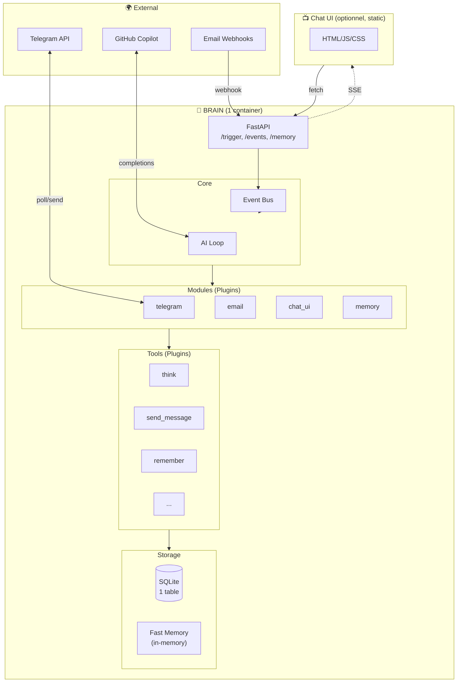

# 🏆 Recommandation Finale

## Comparatif des Propositions

| Critère | A. Ultra-Simple | B. Event Sourcing | C. Monolithe Modulaire | D. Serverless |
|---------|-----------------|-------------------|------------------------|---------------|
| **Simplicité** | ⭐⭐⭐⭐ | ⭐⭐ | ⭐⭐⭐⭐⭐ | ⭐⭐⭐ |
| **Extensibilité** | ⭐⭐⭐ | ⭐⭐⭐⭐⭐ | ⭐⭐⭐⭐ | ⭐⭐⭐⭐ |
| **Scalabilité** | ⭐⭐ | ⭐⭐⭐⭐⭐ | ⭐⭐⭐ | ⭐⭐⭐⭐⭐ |
| **Debuggabilité** | ⭐⭐⭐⭐ | ⭐⭐⭐ | ⭐⭐⭐⭐⭐ | ⭐⭐⭐ |
| **Coût ops** | ⭐⭐⭐⭐⭐ | ⭐⭐ | ⭐⭐⭐⭐⭐ | ⭐⭐⭐⭐ |
| **Time to market** | ⭐⭐⭐⭐ | ⭐⭐ | ⭐⭐⭐⭐⭐ | ⭐⭐⭐ |

---

## 🎯 Ma Recommandation: Proposition C (Monolithe Modulaire)

### Pourquoi?

1. **Tu veux simplifier** → 1 container au lieu de 8
2. **Tu veux ajouter des services** → Système de modules/plugins
3. **Tu veux une DB simple** → Une seule table
4. **Tu veux garder la flexibilité** → Event bus interne
5. **C'est un projet personnel** → Pas besoin de micro-services

---

## Architecture Recommandée



---

## Plan de Migration

### Phase 1: Créer le nouveau Brain (1-2 jours)

```
brain/
├── main.py
├── core/
│   ├── event_bus.py
│   └── ai_loop.py
├── modules/
│   ├── telegram.py
│   └── memory.py
├── tools/
│   └── (copier depuis mcp-server/tools/)
└── storage/
    └── database.py
```

### Phase 2: Migrer les fonctionnalités (1 jour par module)

1. ✅ Memory (remember, recall, fast memory)
2. ✅ Telegram (send, receive)
3. ✅ Tools (tous les tools existants)
4. ✅ Chat UI (connecter au nouveau /trigger)

### Phase 3: Supprimer les anciens services

```yaml
# Avant: 8 services
services:
  chat-ui, copilot-proxy, mcp-server, zapier-bridge,
  event-trigger, memory-service, telegram-bot, n8n

# Après: 1 service + 1 UI statique
services:
  brain:
    build: ./brain
    ports: ["8080:8080"]
  
  chat-ui:  # Optionnel, peut être servi par brain
    image: nginx
    volumes: ["./chat-ui/static:/usr/share/nginx/html"]
```

---

## Database Finale: UNE TABLE

```sql
CREATE TABLE store (
    id TEXT PRIMARY KEY,
    type TEXT NOT NULL,        -- "event", "memory", "user"
    user_id TEXT,
    session_id TEXT,
    data TEXT NOT NULL,        -- JSON
    created_at TIMESTAMP DEFAULT CURRENT_TIMESTAMP
);

CREATE INDEX idx_type ON store(type);
CREATE INDEX idx_user ON store(user_id);
CREATE INDEX idx_session ON store(session_id);
CREATE INDEX idx_created ON store(created_at DESC);
```

### Types de données:

```json
// User (remplace linked_accounts + user)
{
  "id": "user_123",
  "type": "user",
  "user_id": "123",
  "data": {
    "telegram_chat_id": "123456",
    "email": "user@example.com",
    "preferences": {"language": "fr"}
  }
}

// Memory (RAG)
{
  "id": "mem_abc",
  "type": "memory",
  "user_id": "123",
  "data": {
    "category": "preference",
    "content": "Préfère les réponses courtes"
  }
}

// Event (logs)
{
  "id": "evt_xyz",
  "type": "event",
  "user_id": "123",
  "session_id": "sess_abc",
  "data": {
    "event_type": "message",
    "source": "telegram",
    "content": "Hello!"
  }
}
```

---

## Fast Memory

```python
class FastMemory:
    """Cache en mémoire, toujours inclus dans le prompt"""
    
    _cache: Dict[str, str] = {}
    MAX_TOKENS = 500
    
    @classmethod
    async def get(cls, user_id: str) -> str:
        if user_id not in cls._cache:
            cls._cache[user_id] = await cls._build(user_id)
        return cls._cache[user_id]
    
    @classmethod
    async def _build(cls, user_id: str) -> str:
        # User info
        user = await db.get_one(type="user", user_id=user_id)
        
        # Recent memories
        memories = await db.search(type="memory", user_id=user_id, limit=10)
        
        parts = []
        if user:
            parts.append(f"User: {user['data']}")
        for m in memories:
            parts.append(f"- {m['data']['content']}")
        
        return "\n".join(parts)[:cls.MAX_TOKENS * 4]
    
    @classmethod
    def invalidate(cls, user_id: str):
        cls._cache.pop(user_id, None)
```

---

## Prochaines Étapes

1. **Valider** cette architecture avec toi
2. **Créer** la structure `brain/`
3. **Migrer** les tools
4. **Implémenter** l'event bus
5. **Connecter** Telegram
6. **Connecter** Chat UI
7. **Supprimer** les anciens services

---

## Questions Ouvertes

1. **Garder n8n?** → Probablement oui, c'est utile pour les webhooks complexes
2. **Zapier bridge?** → Peut devenir un simple module
3. **Chat UI séparé ou intégré?** → Je recommande intégré dans brain (FastAPI + static files)

---

## Résumé

| Avant | Après |
|-------|-------|
| 8 containers | 1 container |
| 5 tables | 1 table |
| ~3000 lignes | ~1500 lignes |
| Complexité: 🔴 | Complexité: 🟢 |
| Debug: 😰 | Debug: 😊 |
