# 💡 Proposition E: Services Modulaires avec Contrats Clairs

## Philosophie

> **"Des blocs LEGO qu'on connecte"**

Chaque service a:
- **1 INPUT clairement défini**
- **1 OUTPUT clairement défini**
- **Contrat simple** (on sait ce qu'il fait sans voir l'intérieur)

---

## 🧱 Les Blocs

```mermaid
flowchart LR
    subgraph Triggers["📥 TRIGGERS"]
        T1["telegram-trigger"]
        T2["chat-ui-trigger"] 
        T3["email-trigger"]
        T4["slack-trigger"]
    end

    subgraph Core["🧠 CORE"]
        AI["ai-brain"]
    end

    subgraph Outputs["📤 OUTPUTS"]
        O1["telegram-sender"]
        O2["email-sender"]
        O3["slack-sender"]
    end

    subgraph Storage["💾 STORAGE"]
        Logs["event-log"]
        Memory["memory-store"]
    end

    subgraph Interfaces["👁️ INTERFACES"]
        UI["chat-ui"]
        TGBot["telegram-bot"]
    end

    T1 & T2 & T3 & T4 -->|"TriggerEvent"| AI
    AI -->|"LogEvent"| Logs
    AI -->|"SendCommand"| O1 & O2 & O3
    AI <-->|"MemoryQuery"| Memory
    
    Logs -.->|"stream"| UI & TGBot
```



---

## 📋 Contrats de chaque Service

### 1. `telegram-trigger`
```yaml
INPUT:  Telegram Update (via polling ou webhook)
OUTPUT: TriggerEvent → ai-brain
```
```json
// OUTPUT: TriggerEvent
{
  "source": "telegram",
  "user_id": "123456",
  "session_id": "tg_123456_1701234567",
  "message": "Hello!",
  "context": {
    "chat_id": "123456",
    "username": "john"
  }
}
```

---

### 2. `chat-ui-trigger`
```yaml
INPUT:  HTTP POST /trigger {message, session_id?}
OUTPUT: TriggerEvent → ai-brain
```
```json
// OUTPUT: TriggerEvent
{
  "source": "chat_ui",
  "user_id": "browser_abc",
  "session_id": "ui_abc_1701234567",
  "message": "Hello!",
  "context": {}
}
```

---

### 3. `email-trigger`
```yaml
INPUT:  Webhook POST /webhook/email (from n8n, Zapier, etc.)
OUTPUT: TriggerEvent → ai-brain
```
```json
// OUTPUT: TriggerEvent  
{
  "source": "email",
  "user_id": "user@example.com",
  "session_id": "email_xxx_1701234567",
  "message": "New email from sender@example.com: Subject here\n\nBody...",
  "context": {
    "from": "sender@example.com",
    "subject": "Subject here",
    "to": "user@example.com"
  }
}
```

---

### 4. `ai-brain` ⭐ (le cœur)
```yaml
INPUT:  TriggerEvent
OUTPUT: 
  - LogEvent → event-log (TOUT ce que l'IA fait, streamé en temps réel)
  - SendCommand → senders (telegram, email, etc.)
  - MemoryQuery ↔ memory-store
```

```json
// INPUT: TriggerEvent (voir ci-dessus)

// OUTPUT: LogEvent (streamé vers event-log)
{
  "type": "thinking|message|tool_call|tool_result|artifact|error",
  "session_id": "tg_123456_1701234567",
  "user_id": "123456",
  "source": "telegram",
  "timestamp": "2025-12-03T10:00:00Z",
  "data": {
    "content": "...",
    // autres champs selon le type
  }
}

// OUTPUT: SendCommand (vers les senders)
{
  "target": "telegram|email|slack",
  "user_id": "123456",
  "data": {
    "chat_id": "123456",  // pour telegram
    "message": "Hello!"
  }
}
```

---

### 5. `event-log` 
```yaml
INPUT:  LogEvent (depuis ai-brain)
OUTPUT: 
  - Stream SSE /events/{session_id}
  - Persist en DB pour historique
```

C'est le **"logger temps réel"** que tu voulais !

```json
// INPUT: LogEvent
{
  "type": "message",
  "session_id": "tg_123456_1701234567",
  "data": {"content": "Hello!"}
}

// OUTPUT: SSE stream
GET /events/tg_123456_1701234567
→ data: {"type": "thinking", "data": {"content": "Let me think..."}}
→ data: {"type": "message", "data": {"content": "Hello!"}}
→ data: {"type": "artifact", "data": {"title": "...", "content": "..."}}
```

---

### 6. `memory-store`
```yaml
INPUT:  MemoryQuery (read/write)
OUTPUT: MemoryResponse
```

```json
// INPUT: Write
{
  "action": "write",
  "user_id": "123456",
  "type": "memory|user|config",
  "data": {"content": "User prefers short answers"}
}

// INPUT: Read (RAG)
{
  "action": "search",
  "user_id": "123456",
  "query": "user preferences"
}

// INPUT: Fast Memory
{
  "action": "get_fast",
  "user_id": "123456"
}

// OUTPUT
{
  "success": true,
  "results": [...]
}
```

---

### 7. `telegram-sender`
```yaml
INPUT:  SendCommand
OUTPUT: Message envoyé sur Telegram
```

```json
// INPUT: SendCommand
{
  "target": "telegram",
  "data": {
    "chat_id": "123456",
    "message": "Hello!"
  }
}

// OUTPUT: (side effect) → Message sur Telegram
```

---

### 8. `chat-ui` (Interface)
```yaml
INPUT:  
  - Stream depuis event-log (SSE)
  - User input (browser)
OUTPUT: 
  - TriggerEvent → chat-ui-trigger
  - Affichage dans le browser
```

**Important:** Chat UI **observe** les logs de sa session et affiche tout en temps réel.

---

### 9. `telegram-bot` (Interface)
```yaml
INPUT:
  - Stream depuis event-log (SSE) 
  - Messages Telegram (via telegram-trigger)
OUTPUT:
  - Affichage dans Telegram (via telegram-sender)
```

**Logique:**
- Observe les logs pour les sessions qui le concernent
- Filtre: affiche seulement les events de type `message`, `artifact`, etc.
- N'affiche PAS les events des autres sources (sauf si voulu)

---

## 🔗 Comment ça se connecte

```mermaid
flowchart TB
    subgraph "Telegram Flow"
        TGUser["👤 User Telegram"]
        TGTrigger["telegram-trigger"]
        TGSender["telegram-sender"]
        TGBot["telegram-bot<br/>(interface)"]
    end

    subgraph "Chat UI Flow"
        Browser["👤 Browser"]
        UITrigger["chat-ui-trigger"]
        ChatUI["chat-ui<br/>(interface)"]
    end

    subgraph "Core"
        AI["ai-brain"]
        EventLog["event-log"]
        Memory["memory-store"]
    end

    TGUser -->|"message"| TGTrigger
    TGTrigger -->|"TriggerEvent"| AI
    AI -->|"LogEvent"| EventLog
    AI -->|"SendCommand"| TGSender
    TGSender -->|"message"| TGUser
    EventLog -.->|"stream"| TGBot
    TGBot -.->|"display"| TGUser

    Browser -->|"input"| UITrigger
    UITrigger -->|"TriggerEvent"| AI
    EventLog -.->|"stream"| ChatUI
    ChatUI -.->|"display"| Browser

    AI <-->|"MemoryQuery"| Memory

    style AI fill:#fff3e0,stroke:#e65100
    style EventLog fill:#e3f2fd,stroke:#1565c0
```



---

## 📦 Réorganisation des Services Existants

| Ancien | Nouveau | Notes |
|--------|---------|-------|
| `copilot-proxy` | `ai-brain` | Garde la logique, simplifie l'API |
| `mcp-server` | Intégré dans `ai-brain` | Les tools sont des plugins |
| `memory-service` | `memory-store` | Simplifie: 1 table |
| `event-trigger` | `email-trigger`, `slack-trigger` | Split par source |
| `telegram-bot` | `telegram-trigger` + `telegram-bot` | Sépare trigger/interface |
| `chat-ui` | `chat-ui-trigger` + `chat-ui` | Sépare trigger/interface |
| `zapier-bridge` | Module dans `ai-brain` | Ou trigger séparé |
| - (nouveau) | `event-log` | Le logger central |

---

## 🗄️ Database Simplifiée

Toujours **1 table** dans `memory-store`:

```sql
CREATE TABLE store (
    id TEXT PRIMARY KEY,
    type TEXT NOT NULL,     -- "event", "memory", "user"
    user_id TEXT,
    session_id TEXT,
    data JSON NOT NULL,
    created_at TIMESTAMP DEFAULT CURRENT_TIMESTAMP
);
```

Et `event-log` a sa propre table append-only:

```sql
CREATE TABLE events (
    id TEXT PRIMARY KEY,
    type TEXT NOT NULL,
    session_id TEXT NOT NULL,
    user_id TEXT,
    source TEXT,
    data JSON NOT NULL,
    created_at TIMESTAMP DEFAULT CURRENT_TIMESTAMP
);
```

---

## ✅ Avantages de cette approche

1. **Contrats clairs** - On sait exactement ce que chaque service fait
2. **Blocs interchangeables** - Changer un sender = 0 impact sur le reste
3. **Debugging facile** - On peut tester chaque bloc isolément
4. **Extensible** - Ajouter Slack = créer `slack-trigger` + `slack-sender`
5. **Event log central** - Tout est observable, streamable

---

## 🆚 Comparaison avec l'existant

| Aspect | Avant | Après |
|--------|-------|-------|
| Services | 8 (couplés) | 8-10 (découplés) |
| Contrats | Implicites | Explicites |
| Ajout d'un canal | Modifier plusieurs services | Créer trigger + sender |
| Debugging | Suivre entre services | Log central |
| Streaming | Complexe | Natif (event-log) |
