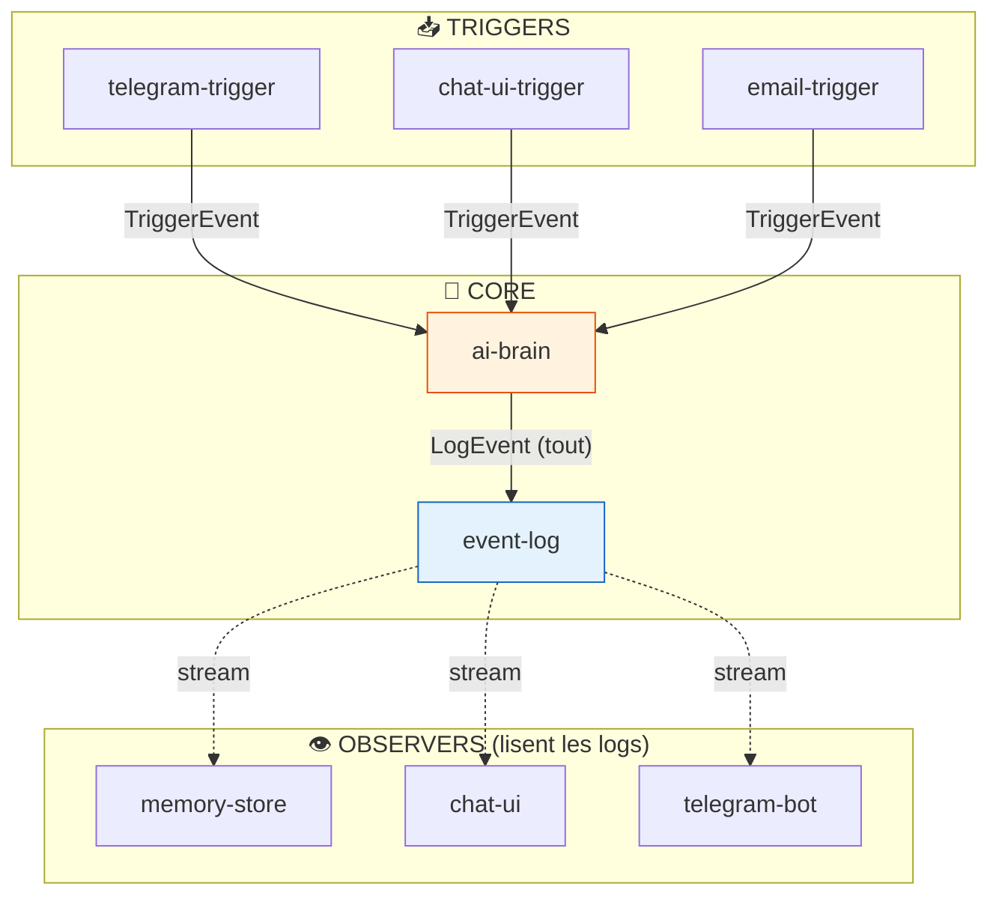
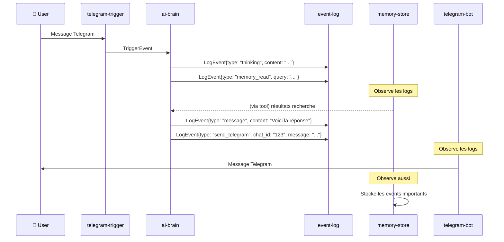

# 🏆 Architecture Finale - Services Modulaires Simplifiés

## Principe

> **Tout passe par les logs. Les services observent et réagissent.**

```
TRIGGERS ──► AI-BRAIN ──► EVENT-LOG ◄── OBSERVERS (memory, chat-ui, telegram-bot, ...)
                              │
                              └── (stream SSE)
```

---

## 🧱 Les Blocs



---

## Simplifications vs Proposition E

| Avant (Proposition E) | Après (Simplifié) |
|----------------------|-------------------|
| `ai-brain` écrit dans `memory-store` | `memory-store` **observe** les logs |
| `ai-brain` appelle `telegram-sender` | `telegram-bot` **observe** les logs et envoie |
| 3 types de communications | **1 seul**: tout passe par `event-log` |
| SendCommand séparé | Inclus dans LogEvent |

---

## 📋 Services (6 au lieu de 10)

### 1. `telegram-trigger`
```yaml
INPUT:  Telegram API (polling)
OUTPUT: TriggerEvent → ai-brain
```

### 2. `chat-ui-trigger`
```yaml
INPUT:  HTTP POST /trigger
OUTPUT: TriggerEvent → ai-brain
```

### 3. `email-trigger`
```yaml
INPUT:  Webhook POST
OUTPUT: TriggerEvent → ai-brain
```

### 4. `ai-brain` ⭐
```yaml
INPUT:  TriggerEvent
OUTPUT: LogEvent → event-log (TOUT passe par là)
TOOLS:  memory_read, memory_write, think, send_message, etc.
```

### 5. `event-log` ⭐
```yaml
INPUT:  LogEvent (depuis ai-brain)
OUTPUT: 
  - SSE stream /events/{session_id}
  - SSE stream /events/all (pour observers)
  - Persist en DB
```

### 6. `memory-store` (Observer)
```yaml
INPUT:  Stream depuis event-log
OUTPUT: 
  - Stocke les events type "memory_write" dans sa DB
  - API GET /search pour le tool memory_read
```

### 7. `chat-ui` (Observer)
```yaml
INPUT:  Stream depuis event-log (filtre par session)
OUTPUT: Affichage browser
```

### 8. `telegram-bot` (Observer)
```yaml
INPUT:  Stream depuis event-log (filtre par source=telegram)
OUTPUT: Envoie les messages sur Telegram
```

---

## 🔄 Flow Complet



---

## 📝 LogEvent Unifié

**Un seul format pour TOUT:**

```typescript
interface LogEvent {
  id: string;
  type: LogEventType;
  session_id: string;
  user_id: string;
  source: string;           // "telegram", "chat_ui", "email"
  timestamp: string;
  data: any;
}

type LogEventType =
  // Processing
  | "trigger"               // Début
  | "thinking"              // Réflexion IA
  | "thinking_delta"        // Chunk streaming
  | "tool_call"             // Appel tool
  | "tool_result"           // Résultat tool
  | "message"               // Message final
  | "message_delta"         // Chunk streaming
  | "done"                  // Fin
  
  // Artifacts
  | "artifact"              // Création
  | "artifact_edit"         // Modification
  
  // Memory (observé par memory-store)
  | "memory_write"          // Écrire en mémoire
  | "memory_read"           // Lire (le tool appelle memory-store directement)
  
  // Send (observé par telegram-bot, etc.)
  | "send_telegram"         // Envoyer sur Telegram
  | "send_email"            // Envoyer email
  
  // Errors
  | "error";
```

### Exemples:

```json
// L'IA veut envoyer un message Telegram
{
  "type": "send_telegram",
  "session_id": "tg_123_1701234567",
  "user_id": "123",
  "source": "telegram",
  "data": {
    "chat_id": "123",
    "message": "Bonjour !"
  }
}

// L'IA veut mémoriser quelque chose
{
  "type": "memory_write",
  "session_id": "tg_123_1701234567",
  "user_id": "123",
  "source": "telegram",
  "data": {
    "category": "preference",
    "content": "L'utilisateur préfère les réponses courtes"
  }
}

// Un artifact créé
{
  "type": "artifact",
  "session_id": "ui_abc_1701234567",
  "user_id": "abc",
  "source": "chat_ui",
  "data": {
    "title": "Dashboard",
    "artifact_type": "html",
    "content": "<!DOCTYPE html>..."
  }
}
```

---

## 🗄️ Databases

### `event-log` (append-only)
```sql
CREATE TABLE events (
    id TEXT PRIMARY KEY,
    type TEXT NOT NULL,
    session_id TEXT NOT NULL,
    user_id TEXT,
    source TEXT,
    data JSON NOT NULL,
    created_at TIMESTAMP DEFAULT CURRENT_TIMESTAMP
);

CREATE INDEX idx_session ON events(session_id);
CREATE INDEX idx_type ON events(type);
CREATE INDEX idx_user ON events(user_id);
```

### `memory-store` (pour RAG)
```sql
CREATE TABLE store (
    id TEXT PRIMARY KEY,
    type TEXT NOT NULL,     -- "memory", "user"
    user_id TEXT,
    data JSON NOT NULL,
    created_at TIMESTAMP DEFAULT CURRENT_TIMESTAMP
);

CREATE INDEX idx_type ON store(type);
CREATE INDEX idx_user ON store(user_id);
```

---

## 🔧 Tools dans ai-brain

```python
# Le tool memory_read appelle directement memory-store
def memory_read(query: str, user_id: str = None) -> list:
    """Recherche dans la mémoire"""
    response = httpx.get(f"{MEMORY_URL}/search", params={"q": query, "user_id": user_id})
    return response.json()

# Le tool memory_write émet juste un LogEvent
# memory-store l'observe et stocke
def memory_write(content: str, category: str = "general") -> dict:
    """Mémorise une information (sera capté par memory-store)"""
    return {"stored": True, "content": content}  # L'event est émis automatiquement
```

---

## 🐳 docker-compose.yml

```yaml
services:
  # === TRIGGERS ===
  telegram-trigger:
    build: ./triggers/telegram
    environment:
      - TELEGRAM_BOT_TOKEN=${TELEGRAM_BOT_TOKEN}
      - AI_BRAIN_URL=http://ai-brain:8080

  chat-ui-trigger:
    build: ./triggers/chat-ui
    ports: ["3001:3001"]
    environment:
      - AI_BRAIN_URL=http://ai-brain:8080

  # === CORE ===
  ai-brain:
    build: ./core/ai-brain
    ports: ["8080:8080"]
    environment:
      - COPILOT_TOKEN=${COPILOT_TOKEN}
      - EVENT_LOG_URL=http://event-log:8085
      - MEMORY_URL=http://memory-store:8084

  event-log:
    build: ./core/event-log
    ports: ["8085:8085"]
    volumes:
      - event_data:/app/data

  # === OBSERVERS ===
  memory-store:
    build: ./observers/memory-store
    ports: ["8084:8084"]
    environment:
      - EVENT_LOG_URL=http://event-log:8085
    volumes:
      - memory_data:/app/data

  chat-ui:
    build: ./observers/chat-ui
    ports: ["3000:3000"]
    environment:
      - TRIGGER_URL=http://chat-ui-trigger:3001
      - EVENT_LOG_URL=http://event-log:8085

  telegram-bot:
    build: ./observers/telegram-bot
    environment:
      - TELEGRAM_BOT_TOKEN=${TELEGRAM_BOT_TOKEN}
      - EVENT_LOG_URL=http://event-log:8085

volumes:
  event_data:
  memory_data:
```

---

## 📁 Structure simplifiée

```
multi_agent/
├── triggers/
│   ├── telegram/          # Reçoit de Telegram → TriggerEvent
│   ├── chat-ui/           # Reçoit du browser → TriggerEvent
│   └── email/             # Reçoit webhooks → TriggerEvent
│
├── core/
│   ├── ai-brain/          # TriggerEvent → LogEvents
│   │   ├── main.py
│   │   ├── loop.py
│   │   └── tools/
│   └── event-log/         # Stocke et stream les LogEvents
│       └── main.py
│
├── observers/
│   ├── memory-store/      # Observe → stocke memories
│   ├── chat-ui/           # Observe → affiche browser
│   └── telegram-bot/      # Observe → envoie Telegram
│
└── docker-compose.yml
```

---

## ✅ Avantages finaux

1. **Ultra simple** - Tout passe par event-log
2. **Découplé** - Les observers ne connaissent que event-log
3. **Extensible** - Nouveau canal = nouveau trigger + observer
4. **Debuggable** - Tous les events dans un seul endroit
5. **Streamable** - SSE natif depuis event-log

---

## 🆚 Comparaison

| Aspect | Actuel (8 services) | Proposition E (10) | **Final (7)** |
|--------|--------------------|--------------------|---------------|
| Services | 8 | 10 | **7** |
| Communications | Mesh complexe | 3 types | **1 type** |
| Point central | Aucun | event-log | **event-log** |
| Ajout canal | Modifier plusieurs | 2 nouveaux | **2 nouveaux** |
