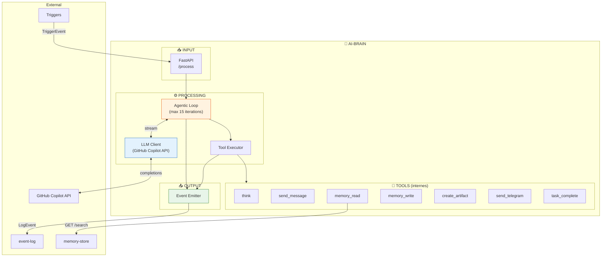
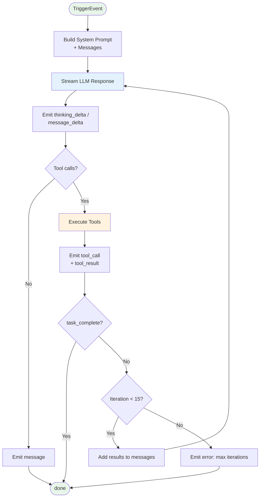
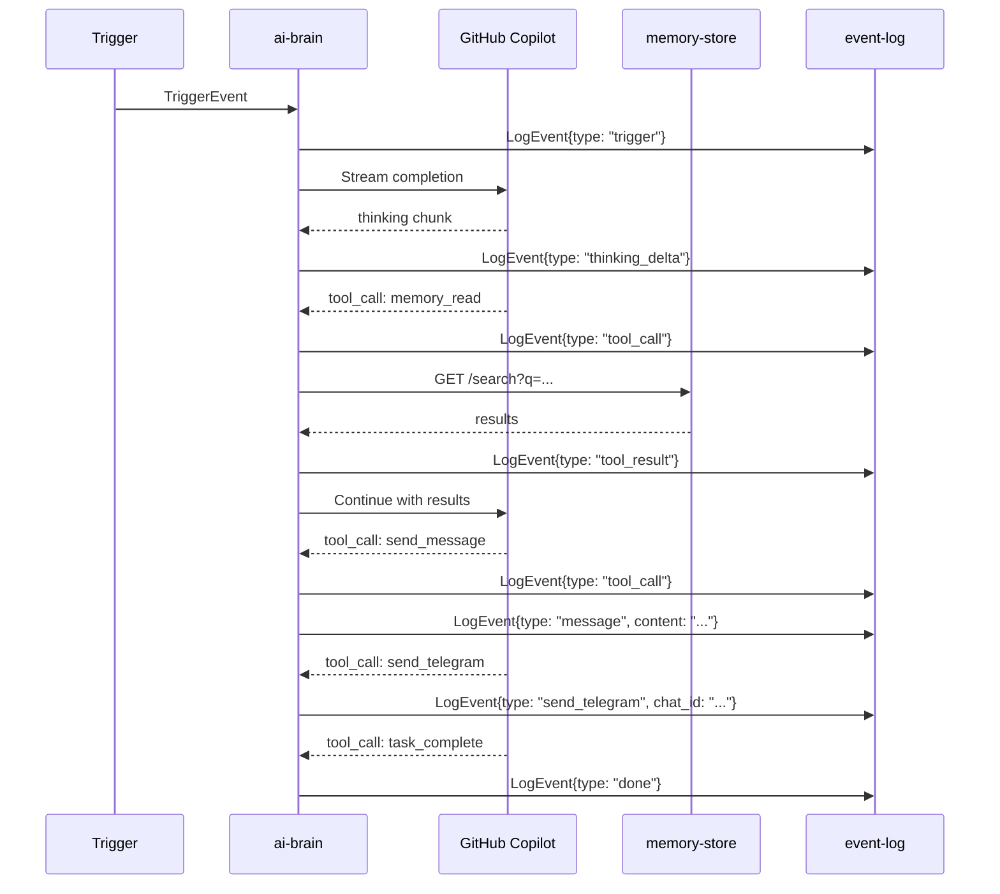

# 🧠 AI-BRAIN - Architecture Interne

## Vue d'ensemble

`ai-brain` est le cerveau du système. Il reçoit des `TriggerEvent`, exécute une boucle agentique, et émet des `LogEvent` vers `event-log`.

```
TriggerEvent ──► AI-BRAIN ──► LogEvent (vers event-log)
                    │
                    ├── 🔄 Agentic Loop
                    ├── 🤖 LLM Client (GitHub Copilot)
                    ├── 🔧 Tools (internes)
                    └── 📡 Event Emitter
```

---

## 🧱 Composants Internes



---

## 📥 INPUT: TriggerEvent

```typescript
interface TriggerEvent {
  source: "telegram" | "chat_ui" | "email" | "slack" | ...;
  user_id: string;
  session_id: string;
  message: string;
  context?: {
    conversation_history?: Message[];
    user_preferences?: object;
    trigger_instructions?: string;
  };
}
```

**Exemple:**
```json
{
  "source": "telegram",
  "user_id": "123456",
  "session_id": "tg_123456_1701234567",
  "message": "Quel temps fait-il à Paris ?",
  "context": {
    "conversation_history": [
      {"role": "user", "content": "Bonjour"},
      {"role": "assistant", "content": "Bonjour ! Comment puis-je vous aider ?"}
    ]
  }
}
```

---

## 📤 OUTPUT: LogEvent

Tous les outputs passent par l'Event Emitter vers `event-log`:

```typescript
interface LogEvent {
  id: string;
  type: LogEventType;
  session_id: string;
  user_id: string;
  source: string;
  timestamp: string;
  data: any;
}
```

---

## ⚙️ Composants Détaillés

### 1. API Endpoint

```python
# main.py
from fastapi import FastAPI
from pydantic import BaseModel

app = FastAPI()

class TriggerEvent(BaseModel):
    source: str
    user_id: str
    session_id: str
    message: str
    context: dict = {}

@app.post("/process")
async def process(event: TriggerEvent):
    """Point d'entrée unique pour tous les triggers"""
    async for log_event in agentic_loop(event):
        await emit_to_event_log(log_event)
    return {"status": "done", "session_id": event.session_id}
```

---

### 2. Agentic Loop

La boucle principale qui orchestre LLM + Tools:



```python
# loop.py
async def agentic_loop(event: TriggerEvent):
    messages = build_messages(event)
    iteration = 0
    MAX_ITERATIONS = 15
    
    while iteration < MAX_ITERATIONS:
        iteration += 1
        
        # Stream LLM response
        tool_calls = []
        async for chunk in stream_llm(messages):
            if chunk.type == "content":
                yield LogEvent(type="message_delta", data={"content": chunk.content})
            elif chunk.type == "tool_call":
                tool_calls.append(chunk.tool_call)
        
        if not tool_calls:
            yield LogEvent(type="done")
            break
        
        # Execute tools
        for tool_call in tool_calls:
            yield LogEvent(type="tool_call", data=tool_call)
            result = await execute_tool(tool_call)
            yield LogEvent(type="tool_result", data=result)
            
            # Emit specific events based on tool
            if tool_event := tool_to_event(tool_call, result):
                yield tool_event
            
            if is_terminal(tool_call.name):
                yield LogEvent(type="done")
                return
        
        # Add results to messages for next iteration
        messages = add_tool_results(messages, tool_calls, results)
    
    yield LogEvent(type="error", data={"message": "Max iterations reached"})
```

---

### 3. LLM Client

Connexion à GitHub Copilot API avec streaming:

```python
# llm_client.py
import httpx

COPILOT_API = "https://api.githubcopilot.com/chat/completions"

async def stream_llm(messages: list, tools: list):
    """Stream completions from GitHub Copilot"""
    token = await get_copilot_token()
    
    async with httpx.AsyncClient() as client:
        async with client.stream(
            "POST",
            COPILOT_API,
            headers={"Authorization": f"Bearer {token}"},
            json={
                "model": "gpt-4.1",
                "messages": messages,
                "tools": tools,
                "stream": True
            }
        ) as response:
            async for line in response.aiter_lines():
                if line.startswith("data: "):
                    chunk = parse_sse(line)
                    yield chunk
```

---

### 4. Tool Executor

Exécute les tools et génère les events appropriés:

```python
# tool_executor.py

TOOLS = {
    "think": think_tool,
    "send_message": send_message_tool,
    "memory_read": memory_read_tool,
    "memory_write": memory_write_tool,
    "create_artifact": artifact_tool,
    "send_telegram": send_telegram_tool,
    "task_complete": task_complete_tool,
}

async def execute_tool(tool_call: ToolCall) -> dict:
    """Execute a tool and return result"""
    tool_fn = TOOLS.get(tool_call.name)
    if not tool_fn:
        return {"error": f"Unknown tool: {tool_call.name}"}
    
    return await tool_fn(**tool_call.arguments)

def tool_to_event(tool_call: ToolCall, result: dict) -> LogEvent | None:
    """Convert tool result to LogEvent for observers"""
    name = tool_call.name
    args = tool_call.arguments
    
    if name == "think":
        return LogEvent(type="thinking", data={"content": args["thought"]})
    
    elif name == "send_message":
        return LogEvent(type="message", data={"content": args["message"]})
    
    elif name == "create_artifact":
        return LogEvent(type="artifact", data={
            "title": args["title"],
            "artifact_type": args["type"],
            "content": result["content"]
        })
    
    elif name == "send_telegram":
        return LogEvent(type="send_telegram", data={
            "chat_id": args["chat_id"],
            "message": args["message"]
        })
    
    elif name == "memory_write":
        return LogEvent(type="memory_write", data={
            "category": args.get("category", "general"),
            "content": args["content"]
        })
    
    return None

def is_terminal(tool_name: str) -> bool:
    return tool_name == "task_complete"
```

---

### 5. Event Emitter

Envoie les LogEvents vers event-log:

```python
# event_emitter.py
import httpx
import uuid
from datetime import datetime

EVENT_LOG_URL = os.getenv("EVENT_LOG_URL", "http://event-log:8085")

async def emit_to_event_log(event: LogEvent):
    """Send event to event-log service"""
    async with httpx.AsyncClient() as client:
        await client.post(
            f"{EVENT_LOG_URL}/events",
            json={
                "id": str(uuid.uuid4()),
                "type": event.type,
                "session_id": event.session_id,
                "user_id": event.user_id,
                "source": event.source,
                "timestamp": datetime.utcnow().isoformat(),
                "data": event.data
            }
        )
```

---

## 🔧 Tools Internes

| Tool | Description | LogEvent émis | Appel externe |
|------|-------------|---------------|---------------|
| `think` | Raisonnement step-by-step | `thinking` | ❌ |
| `send_message` | Message à l'utilisateur | `message` | ❌ |
| `memory_read` | Recherche en mémoire | - | `memory-store` |
| `memory_write` | Stocke une info | `memory_write` | ❌ (observer) |
| `create_artifact` | Crée HTML/MD/Code | `artifact` | ❌ |
| `edit_artifact` | Modifie un artifact | `artifact_edit` | ❌ |
| `send_telegram` | Notification TG | `send_telegram` | ❌ (observer) |
| `send_email` | Notification email | `send_email` | ❌ (observer) |
| `search_web` | Recherche web | - | API externe |
| `get_weather` | Météo | - | API externe |
| `task_complete` | Termine la boucle | `done` | ❌ |

### Note importante

Les tools comme `send_telegram` et `memory_write` n'appellent **aucun service externe**. Ils émettent juste un `LogEvent` que les **observers** captent et traitent.

```python
# tools/send_telegram.py
async def send_telegram_tool(message: str, chat_id: str = None) -> dict:
    """
    Ce tool n'envoie PAS directement sur Telegram.
    Il retourne juste un résultat.
    L'event LogEvent{type: "send_telegram"} sera capté par telegram-bot (observer).
    """
    return {
        "success": True,
        "message": f"Message queued for Telegram: {message[:50]}..."
    }
```

---

## 🔄 Flow Complet avec Events



---

## 📁 Structure des fichiers

```
core/ai-brain/
├── Dockerfile
├── requirements.txt
├── main.py              # FastAPI + endpoint /process
├── loop.py              # Agentic loop
├── llm_client.py        # GitHub Copilot streaming
├── tool_executor.py     # Execute tools + convert to events
├── event_emitter.py     # Send to event-log
├── prompts.py           # System prompts
├── models.py            # Pydantic models
└── tools/
    ├── __init__.py
    ├── think.py
    ├── send_message.py
    ├── memory_read.py
    ├── memory_write.py
    ├── create_artifact.py
    ├── edit_artifact.py
    ├── send_telegram.py
    ├── send_email.py
    ├── search_web.py
    ├── get_weather.py
    └── task_complete.py
```

---

## 🐳 Docker

```dockerfile
FROM python:3.11-slim

WORKDIR /app

COPY requirements.txt .
RUN pip install --no-cache-dir -r requirements.txt

COPY . .

EXPOSE 8080

CMD ["uvicorn", "main:app", "--host", "0.0.0.0", "--port", "8080"]
```

```yaml
# docker-compose.yml (extrait)
ai-brain:
  build: ./core/ai-brain
  ports: ["8080:8080"]
  environment:
    - COPILOT_TOKEN=${COPILOT_TOKEN}
    - EVENT_LOG_URL=http://event-log:8085
    - MEMORY_URL=http://memory-store:8084
  depends_on:
    - event-log
```

---

## ✅ Résumé

| Aspect | Valeur |
|--------|--------|
| **Input** | `TriggerEvent` (HTTP POST /process) |
| **Output** | `LogEvent` stream vers event-log |
| **LLM** | GitHub Copilot API (streaming) |
| **Tools** | ~12 tools internes |
| **Appels externes** | Seulement `memory-store` (pour read) |
| **Pattern** | Les tools émettent des events, les observers réagissent |
