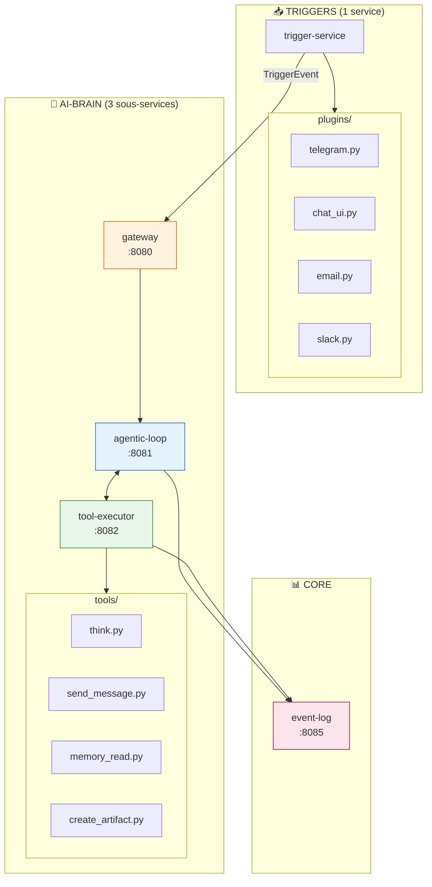
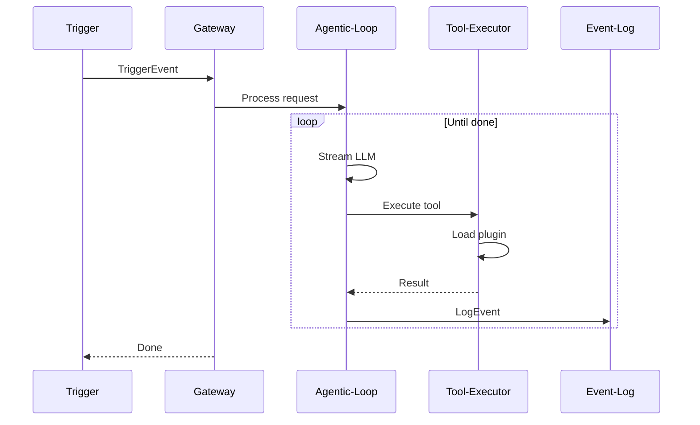
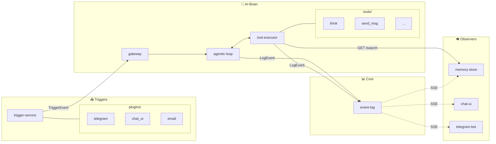

# 📁 Structure des Services - Architecture Finale

## Vue d'ensemble

```
multi_agent/
├── triggers/           # 📥 Service unique + plugins
├── core/               # 🧠 AI-Brain (3 sous-services) + Event-Log
├── observers/          # 👁️ Réagissent aux events
├── shared/             # 📦 Code partagé
├── docker-compose.yml
└── .env
```

---

## 🧱 Architecture AI-Brain (Zoom)



---

## 🗂️ Arborescence Complète

```
multi_agent/
│
├── triggers/                      # 📥 UN SEUL SERVICE avec plugins
│   ├── Dockerfile
│   ├── requirements.txt
│   ├── main.py                    # Charge les plugins, expose /health
│   ├── plugin_loader.py           # Auto-découverte des plugins
│   ├── plugins/                   # 🔌 PLUGINS (1 fichier = 1 source)
│   │   ├── __init__.py
│   │   ├── telegram.py            # Polling Telegram
│   │   ├── chat_ui.py             # HTTP POST /trigger
│   │   ├── email.py               # Webhook email
│   │   ├── slack.py               # Webhook Slack
│   │   └── webhook.py             # Webhook générique
│   └── README.md
│
├── core/
│   │
│   ├── ai-brain/
│   │   │
│   │   ├── gateway/               # 🚪 Point d'entrée unique
│   │   │   ├── Dockerfile
│   │   │   ├── requirements.txt
│   │   │   ├── main.py            # POST /process → route vers loop
│   │   │   └── README.md
│   │   │
│   │   ├── agentic-loop/          # 🔄 Boucle LLM
│   │   │   ├── Dockerfile
│   │   │   ├── requirements.txt
│   │   │   ├── main.py
│   │   │   ├── loop.py            # Logique itérative
│   │   │   ├── llm_client.py      # GitHub Copilot streaming
│   │   │   ├── prompts.py
│   │   │   └── README.md
│   │   │
│   │   └── tool-executor/         # 🔧 Exécution des tools
│   │       ├── Dockerfile
│   │       ├── requirements.txt
│   │       ├── main.py            # POST /execute
│   │       ├── plugin_loader.py   # Auto-découverte
│   │       ├── tools/             # 🔌 PLUGINS TOOLS
│   │       │   ├── __init__.py
│   │       │   ├── think.py
│   │       │   ├── send_message.py
│   │       │   ├── memory_read.py
│   │       │   ├── memory_write.py
│   │       │   ├── create_artifact.py
│   │       │   ├── edit_artifact.py
│   │       │   ├── send_telegram.py
│   │       │   ├── search_web.py
│   │       │   ├── get_weather.py
│   │       │   └── task_complete.py
│   │       └── README.md
│   │
│   └── event-log/
│       ├── Dockerfile
│       ├── requirements.txt
│       ├── main.py
│       ├── database.py
│       ├── stream.py
│       └── README.md
│
├── observers/
│   │
│   ├── memory-store/
│   │   ├── Dockerfile
│   │   ├── requirements.txt
│   │   ├── main.py
│   │   ├── database.py
│   │   ├── subscriber.py
│   │   └── README.md
│   │
│   ├── chat-ui/
│   │   ├── Dockerfile
│   │   ├── requirements.txt
│   │   ├── main.py
│   │   ├── static/
│   │   │   ├── css/
│   │   │   │   └── style.css
│   │   │   └── js/
│   │   │       ├── app.js
│   │   │       ├── sse-client.js
│   │   │       └── ui.js
│   │   ├── templates/
│   │   │   └── index.html
│   │   └── README.md
│   │
│   └── telegram-bot/
│       ├── Dockerfile
│       ├── requirements.txt
│       ├── main.py
│       ├── subscriber.py
│       ├── sender.py
│       └── README.md
│
├── shared/
│   ├── models.py           # TriggerEvent, LogEvent
│   └── config.py           # URLs, constantes
│
├── docker-compose.yml
├── .env
└── README.md
```

---

## 🔌 Système de Plugins

### Principe

> **Ajouter une fonctionnalité = ajouter un fichier**

Pas besoin de modifier le code existant. Les plugins sont auto-découverts au démarrage.

### Interface Plugin Trigger

```python
# triggers/plugins/telegram.py

def get_definition() -> dict:
    """Métadonnées du trigger"""
    return {
        "name": "telegram",
        "description": "Reçoit les messages Telegram via polling",
        "config_schema": {
            "bot_token": {"type": "string", "required": True},
            "polling_interval": {"type": "int", "default": 1}
        }
    }

async def start(config: dict, on_message: Callable):
    """Démarre le trigger (appelé au startup)"""
    bot = TelegramBot(config["bot_token"])
    async for update in bot.poll():
        event = create_trigger_event(update)
        await on_message(event)

def create_trigger_event(data: dict) -> TriggerEvent:
    """Convertit les données brutes en TriggerEvent"""
    return TriggerEvent(
        source="telegram",
        user_id=str(data["chat"]["id"]),
        session_id=f"tg_{data['chat']['id']}",
        message=data["text"],
        context={"chat": data["chat"]}
    )

async def stop():
    """Arrête proprement le trigger"""
    pass
```

### Interface Plugin Tool

```python
# core/ai-brain/tool-executor/tools/think.py

def get_definition() -> dict:
    """Schema OpenAI function"""
    return {
        "type": "function",
        "function": {
            "name": "think",
            "description": "Réfléchir étape par étape",
            "parameters": {
                "type": "object",
                "properties": {
                    "thought": {"type": "string", "description": "La réflexion"}
                },
                "required": ["thought"]
            }
        }
    }

async def execute(thought: str) -> dict:
    """Exécute le tool"""
    return {"thought": thought}

def to_event(args: dict, result: dict) -> dict:
    """Convertit en LogEvent (optionnel)"""
    return {
        "type": "thinking",
        "data": {"content": args["thought"]}
    }

def is_terminal() -> bool:
    """True si ce tool termine la boucle"""
    return False
```

### Auto-Discovery

```python
# triggers/plugin_loader.py (même pattern pour tools)

import importlib
import pkgutil
from pathlib import Path

def load_plugins(plugins_dir: str) -> dict:
    """Charge tous les plugins d'un dossier"""
    plugins = {}
    
    for module_info in pkgutil.iter_modules([plugins_dir]):
        module = importlib.import_module(f"plugins.{module_info.name}")
        
        if hasattr(module, "get_definition"):
            definition = module.get_definition()
            plugins[definition["name"]] = module
            print(f"✅ Loaded plugin: {definition['name']}")
    
    return plugins
```

---

## 📋 Rôle de Chaque Service

### 📥 TRIGGERS (1 service + plugins)

| Service | Rôle | Port |
|---------|------|------|
| **trigger-service** | Charge les plugins, dispatch les messages | 3001 |

| Plugin | Rôle |
|--------|------|
| `telegram.py` | Polling Telegram API |
| `chat_ui.py` | HTTP POST /trigger |
| `email.py` | Webhook email |
| `slack.py` | Webhook Slack |
| `webhook.py` | Webhook générique |

```
INPUT: Messages externes (via plugins)
OUTPUT: TriggerEvent → ai-brain/gateway
```

---

### 🧠 AI-BRAIN (3 sous-services)

| Sous-service | Rôle | Port |
|--------------|------|------|
| **gateway** | Point d'entrée, routing, auth | 8080 |
| **agentic-loop** | Boucle LLM, orchestration | 8081 |
| **tool-executor** | Exécute les tools (plugins) | 8082 |



#### Gateway (`:8080`)
```python
# Rôle: Point d'entrée unique
- POST /process → valide et route vers agentic-loop
- Authentification (future)
- Rate limiting (future)
- Métriques
```

#### Agentic-Loop (`:8081`)
```python
# Rôle: Orchestrer LLM + Tools
- Boucle itérative (max 15)
- Stream vers GitHub Copilot API
- Appelle tool-executor pour chaque tool
- Émet LogEvents vers event-log
```

#### Tool-Executor (`:8082`)
```python
# Rôle: Exécuter les tools
- POST /execute {tool_name, args}
- Auto-découverte des plugins tools/
- Convertit résultats en LogEvents
```

---

### 📊 EVENT-LOG (1 service)

| Service | Rôle | Port |
|---------|------|------|
| **event-log** | Stocke et stream les events | 8085 |

```
INPUT: LogEvent (POST /events)
OUTPUT: 
  - SSE stream /events/stream
  - GET /sessions/{user_id}/latest
  - Persistance SQLite
```

---

### 👁️ OBSERVERS (3 services)

| Service | Rôle | Port |
|---------|------|------|
| **memory-store** | Observe `memory_write` → stocke + `/search` | 8084 |
| **chat-ui** | Observe session → affiche browser | 3000 |
| **telegram-bot** | Observe `send_telegram` → envoie TG | - |

```
INPUT: Stream SSE depuis event-log
OUTPUT: Action spécifique (stockage, affichage, envoi)
```

---

## 🔌 Connexions entre Services



---

## 📝 Fichiers Clés par Service

### `triggers/main.py`
```python
# Rôle: Charger plugins et dispatcher
- plugin_loader.load_plugins("plugins/")
- pour chaque plugin: plugin.start(config, on_message)
- on_message → POST vers ai-brain/gateway
```

### `triggers/plugins/telegram.py`
```python
# Rôle: Recevoir de Telegram
- get_definition() → metadata
- start(config, callback) → polling loop
- create_trigger_event(data) → TriggerEvent
- stop() → cleanup
```

### `core/ai-brain/gateway/main.py`
```python
# Rôle: Point d'entrée
- POST /process → valide TriggerEvent
- Forward vers agentic-loop
- Gère auth/rate-limit (future)
```

### `core/ai-brain/agentic-loop/main.py`
```python
# Rôle: Boucle LLM
- POST /run → démarre la boucle
- stream LLM (llm_client.py)
- appelle tool-executor pour tools
- émet events vers event-log
```

### `core/ai-brain/tool-executor/main.py`
```python
# Rôle: Exécuter tools
- plugin_loader.load_plugins("tools/")
- POST /execute → find plugin, execute
- retourne résultat + émet LogEvent
```

### `core/event-log/main.py`
```python
# Rôle: Stocker et streamer
- POST /events → persist + broadcast
- GET /events/stream?filters → SSE
- GET /sessions/{user_id}/latest → historique
```

### `observers/*/main.py`
```python
# Rôle: Réagir aux events
- subscriber.py → SSE client vers event-log
- filtre par type d'event
- action spécifique (store, display, send)
```

---

## 🐳 docker-compose.yml

```yaml
services:
  # === TRIGGERS ===
  trigger-service:
    build: ./triggers
    ports: ["3001:3001"]
    environment:
      - TELEGRAM_BOT_TOKEN=${TELEGRAM_BOT_TOKEN}
      - AI_BRAIN_URL=http://gateway:8080
      - EVENT_LOG_URL=http://event-log:8085

  # === AI-BRAIN (3 sous-services) ===
  gateway:
    build: ./core/ai-brain/gateway
    ports: ["8080:8080"]
    environment:
      - AGENTIC_LOOP_URL=http://agentic-loop:8081
    depends_on:
      - agentic-loop

  agentic-loop:
    build: ./core/ai-brain/agentic-loop
    ports: ["8081:8081"]
    environment:
      - COPILOT_TOKEN=${COPILOT_TOKEN}
      - TOOL_EXECUTOR_URL=http://tool-executor:8082
      - EVENT_LOG_URL=http://event-log:8085
    depends_on:
      - tool-executor
      - event-log

  tool-executor:
    build: ./core/ai-brain/tool-executor
    ports: ["8082:8082"]
    environment:
      - EVENT_LOG_URL=http://event-log:8085
      - MEMORY_URL=http://memory-store:8084

  # === CORE ===
  event-log:
    build: ./core/event-log
    ports: ["8085:8085"]
    volumes:
      - event_data:/app/data

  # === OBSERVERS ===
  memory-store:
    build: ./observers/memory-store
    ports: ["8084:8084"]
    environment:
      - EVENT_LOG_URL=http://event-log:8085
    volumes:
      - memory_data:/app/data
    depends_on:
      - event-log

  chat-ui:
    build: ./observers/chat-ui
    ports: ["3000:3000"]
    environment:
      - TRIGGER_URL=http://trigger-service:3001
      - EVENT_LOG_URL=http://event-log:8085
    depends_on:
      - event-log
      - trigger-service

  telegram-bot:
    build: ./observers/telegram-bot
    environment:
      - TELEGRAM_BOT_TOKEN=${TELEGRAM_BOT_TOKEN}
      - EVENT_LOG_URL=http://event-log:8085
    depends_on:
      - event-log

volumes:
  event_data:
  memory_data:
```

---

## 📊 Résumé

| Catégorie | Services | Containers |
|-----------|----------|------------|
| **Triggers** | 1 service + N plugins | 1 |
| **AI-Brain** | gateway, agentic-loop, tool-executor | 3 |
| **Core** | event-log | 1 |
| **Observers** | memory-store, chat-ui, telegram-bot | 3 |
| **Total** | | **8 containers** |

### Patterns utilisés

| Pattern | Où | Avantage |
|---------|-----|----------|
| **Plugin** | triggers, tools | Ajouter = ajouter 1 fichier |
| **Gateway** | ai-brain | Point d'entrée unique, auth centralisée |
| **Event Sourcing** | event-log | Historique complet, replay possible |
| **Observer** | observers/* | Découplage total |
