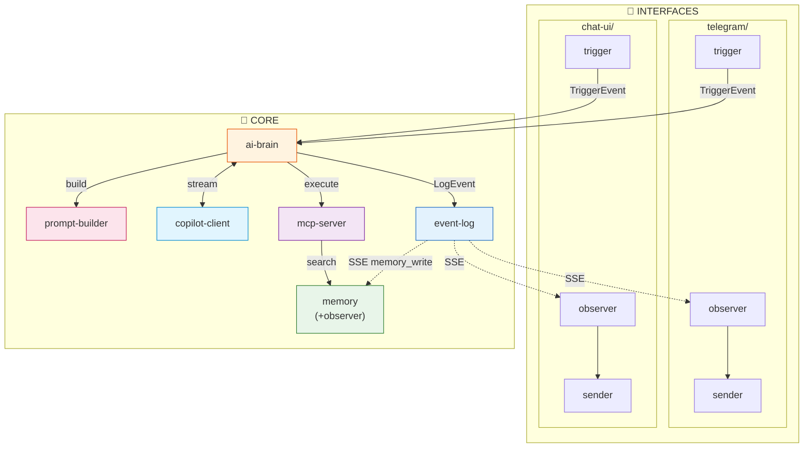

# 🏆 Architecture V2 - Récapitulatif Final

> **Document de référence unique**
> 
> Voir aussi :
> - `14-ARCHITECTURE-PHILOSOPHY.md` - Philosophie SPET
> - `15-AI-PERSPECTIVE.md` - Point de vue de l'IA
> - `16-SERVICE-SEPARATIONS.md` - Analyse des séparations
> - `17-CLARIFICATIONS.md` - Clarifications event-log, prompt-builder, memory

---

## 🔍 Évolution de l'Architecture

| Version | Changement |
|---------|------------|
| V1 | Monolithe copilot-proxy |
| V2.0 | Séparation en 3 core services |
| V2.1 | Séparation en 5 core services (+ copilot-client, mcp-server) |
| V2.2 | Séparation en 7 core services (+ prompt-builder, memory split) |
| V2.3 | **Consolidation à 6 core** (memory unifié avec observer interne) |

---

## ✅ Décisions Finales

### 1. Structure des Interfaces : `interfaces/{name}/` avec 3 sous-services

Chaque canal (telegram, chat-ui, email) est un **package complet** avec :
- `trigger/` - Reçoit les messages
- `observer/` - Écoute event-log
- `sender/` - Envoie les messages

**Memory n'est PAS une interface** - c'est un service core avec un observer intégré.

### 2. Core : 6 services avec 1 responsabilité chacun

| Service | Port | Responsabilité UNIQUE |
|---------|------|----------------------|
| `ai-brain` | 8080 | Orchestration de la boucle agentique |
| `copilot-client` | 8081 | Connexion à GitHub Copilot (token, streaming) |
| `mcp-server` | 8082 | Exécution des tools (plugins) |
| `prompt-builder` | 8083 | Construction des prompts (voir détails ci-dessous) |
| `event-log` | 8085 | Stockage + streaming des LogEvents |
| `memory` | 8086 | CRUD + Search + Observer interne |

**Pourquoi séparer ?**
- Copilot down → erreur dans `copilot-client`, pas ailleurs
- Tool crash → erreur dans `mcp-server`, logs isolés
- Boucle infinie → c'est `ai-brain`, facile à debug
- Nouveau LLM → change juste `copilot-client`
- Nouveau tool → ajoute dans `mcp-server/tools/`
- Itérer les prompts → change juste `prompt-builder`

### 3. Dockerfile générique pour les interfaces

Un seul `Dockerfile.template` utilisé par tous les trigger/observer/sender.
Ça force la structure : si `main.py` n'existe pas ou n'a pas `app` → crash.

### 4. Contrats structurels (pas de validation explicite)

Le système **impose** la structure naturellement :
- Loader appelle `get_definition()` → crash si absent
- Docker fait `uvicorn main:app` → crash si pas de `app`
- Services appellent des endpoints précis → 404 si pas implémentés

---

## 📝 Détail : Prompt-Builder

**Responsabilité** : Transformer un TriggerEvent + contexte en `messages[]` pour le LLM

```python
# INPUT
{
  "source": "telegram",
  "user_message": "Crée un site web",
  "conversation_history": [...],
  "user_memories": [...],
  "trigger_instructions": "..."
}

# OUTPUT
{
  "messages": [
    {"role": "system", "content": "Tu es un assistant..."},
    {"role": "user", "content": "...contexte + historique..."},
    {"role": "user", "content": "Crée un site web"}
  ]
}
```

**Pourquoi séparé ?**
- Testable sans LLM
- Itérable sans toucher la boucle
- A/B testing de prompts
- Spécialisation par source

---

## 🧱 Architecture Finale



---

## 📁 Structure des Fichiers

```
multi_agent/
│
├── core/                              # 🧠 Services centraux (6)
│   │
│   ├── ai-brain/                      # 🎯 Orchestration UNIQUEMENT
│   │   ├── Dockerfile
│   │   ├── requirements.txt
│   │   ├── main.py                    # FastAPI + POST /process
│   │   ├── loop.py                    # Boucle agentique
│   │   └── event_emitter.py           # Envoie vers event-log
│   │
│   ├── copilot-client/                # 🤖 Connexion LLM UNIQUEMENT
│   │   ├── Dockerfile
│   │   ├── requirements.txt
│   │   ├── main.py                    # FastAPI + POST /stream
│   │   ├── copilot.py                 # Token auth + refresh
│   │   └── streaming.py               # SSE streaming
│   │
│   ├── mcp-server/                    # 🔧 Exécution tools UNIQUEMENT
│   │   ├── Dockerfile
│   │   ├── requirements.txt
│   │   ├── main.py                    # FastAPI + GET /tools + POST /execute
│   │   └── tools/                     # 🔌 PLUGINS
│   │       ├── __init__.py
│   │       ├── think.py
│   │       ├── send_message.py
│   │       ├── memory_read.py
│   │       ├── memory_write.py
│   │       ├── create_artifact.py
│   │       ├── send_telegram.py
│   │       └── task_complete.py
│   │
│   ├── prompt-builder/                # 📝 Construction prompts UNIQUEMENT
│   │   ├── Dockerfile
│   │   ├── requirements.txt
│   │   ├── main.py                    # FastAPI + POST /build
│   │   └── templates/                 # Templates de prompts
│   │       ├── system.py              # Prompt système de base
│   │       ├── telegram.py            # Adaptations Telegram
│   │       └── chat_ui.py             # Adaptations Chat-UI
│   │
│   ├── event-log/                     # 📋 Stockage + streaming events
│   │   ├── Dockerfile
│   │   ├── requirements.txt
│   │   ├── main.py                    # POST /events + GET /stream (SSE)
│   │   └── database.py
│   │
│   └── memory/                        # 🧠 Mémoire persistante (store + search)
│       ├── Dockerfile
│       ├── requirements.txt
│       ├── main.py                    # FastAPI + endpoints + observer task
│       ├── database.py                # SQLite/PostgreSQL
│       ├── search.py                  # Recherche sémantique
│       └── observer.py                # Background task: écoute event-log
│       # 
│       # Endpoints:
│       #   POST /write     - Écrire une mémoire
│       #   GET  /read/:id  - Lire une mémoire
│       #   POST /search    - Recherche sémantique
│       #
│       # Observer (background task au démarrage):
│       #   - Écoute event-log SSE
│       #   - Filtre type == "memory_write"
│       #   - Persiste automatiquement
│
├── interfaces/                        # 📱 Canaux de communication
│   │
│   ├── _base/                         # 📐 TEMPLATE (à copier)
│   │   ├── Dockerfile.template        # Dockerfile générique
│   │   ├── trigger/
│   │   │   └── main.py.template
│   │   ├── observer/
│   │   │   └── main.py.template
│   │   └── sender/
│   │       └── main.py.template
│   │
│   ├── telegram/                      # 📱 Interface Telegram (3 services)
│   │   ├── trigger/
│   │   │   ├── main.py                # Polling Telegram → TriggerEvent
│   │   │   └── requirements.txt
│   │   ├── observer/
│   │   │   ├── main.py                # SSE → filtre send_telegram
│   │   │   └── requirements.txt
│   │   └── sender/
│   │       ├── main.py                # POST /send → Telegram API
│   │       └── requirements.txt
│   │
│   └── chat-ui/                       # 💬 Interface Chat Web (3 services)
│       ├── trigger/
│       │   ├── main.py                # HTTP POST → TriggerEvent
│       │   └── requirements.txt
│       ├── observer/
│       │   ├── main.py                # SSE → WebSocket browser
│       │   └── requirements.txt
│       └── sender/
│           ├── main.py                # Sert HTML/JS/CSS
│           ├── requirements.txt
│           ├── static/
│           └── templates/
│
├── shared/                            # 📦 Code partagé
│   ├── models.py                      # TriggerEvent, LogEvent, SendRequest
│   └── config.py                      # URLs, constantes
│
├── docker-compose.yml
└── .env
```

---

## 📐 Dockerfile Générique

```dockerfile
# interfaces/_base/Dockerfile.template
FROM python:3.11-slim

WORKDIR /app

# Dépendances de base (toujours installées)
RUN pip install --no-cache-dir fastapi uvicorn httpx pydantic

# Dépendances spécifiques (si requirements.txt existe)
COPY requirements.txt* ./
RUN if [ -f requirements.txt ]; then pip install --no-cache-dir -r requirements.txt; fi

# Code
COPY . .

# CONTRAT: main.py DOIT exister avec app = FastAPI()
EXPOSE 8000
CMD ["uvicorn", "main:app", "--host", "0.0.0.0", "--port", "8000"]
```

---

## 📜 Contrats (imposés structurellement)

### Contrat Tool (dans `mcp-server/tools/`)

```python
# OBLIGATOIRE - sinon le loader crash
def get_definition() -> dict:
    return {
        "type": "function",
        "function": {
            "name": "...",
            "description": "...",
            "parameters": {...}
        }
    }

def execute(**args) -> dict:
    return {...}

# OPTIONNEL
def to_event(args, result) -> dict | None:
    return {"type": "...", "data": {...}}

def is_terminal() -> bool:
    return False
```

### Contrat copilot-client

```python
# main.py expose:
@app.post("/stream")
async def stream(request: LLMRequest):
    """Stream completion depuis GitHub Copilot"""
    # Gère: token refresh, rate limits, erreurs API
    async for chunk in copilot_stream(request.messages, request.tools):
        yield chunk

@app.get("/health")
async def health():
    """Vérifie que le token Copilot est valide"""
    return {"status": "ok", "token_valid": True}
```

### Contrat mcp-server

```python
# main.py expose:
@app.get("/tools")
async def list_tools():
    """Liste tous les tools disponibles (auto-découverts)"""
    return [tool.get_definition() for tool in tools]

@app.post("/execute")
async def execute(request: ToolRequest):
    """Exécute un tool par son nom"""
    tool = tools[request.name]
    result = await tool.execute(**request.arguments)
    event = tool.to_event(request.arguments, result) if hasattr(tool, 'to_event') else None
    return {"result": result, "event": event, "terminal": tool.is_terminal()}
```

### Contrat Trigger (dans `interfaces/*/trigger/`)

```python
# main.py DOIT avoir:
from fastapi import FastAPI
app = FastAPI()

# DOIT envoyer à ai-brain:
@app.post("/webhook")  # ou autre selon la source
async def receive(...):
    event = TriggerEvent(...)
    await httpx.post(f"{AI_BRAIN_URL}/process", json=event.dict())
```

### Contrat Observer (dans `interfaces/*/observer/`)

```python
# main.py DOIT avoir:
from fastapi import FastAPI
app = FastAPI()

# DOIT se connecter à event-log au startup:
@app.on_event("startup")
async def startup():
    asyncio.create_task(subscribe_to_events())

async def subscribe_to_events():
    async with httpx.stream("GET", f"{EVENT_LOG_URL}/stream?type=send_xxx"):
        async for line in response.aiter_lines():
            event = parse(line)
            await httpx.post(f"{SENDER_URL}/send", json=event.data)
```

### Contrat Sender (dans `interfaces/*/sender/`)

```python
# main.py DOIT avoir:
from fastapi import FastAPI
app = FastAPI()

# DOIT exposer POST /send:
@app.post("/send")
async def send(request: SendRequest):
    # Envoyer via l'API externe (Telegram, SMTP, etc.)
    return {"success": True}
```

---

## 🐳 docker-compose.yml

```yaml
version: '3.8'

services:
  # === CORE (6 services) ===
  ai-brain:
    build: ./core/ai-brain
    ports: ["8080:8080"]
    environment:
      - COPILOT_CLIENT_URL=http://copilot-client:8081
      - MCP_SERVER_URL=http://mcp-server:8082
      - PROMPT_BUILDER_URL=http://prompt-builder:8083
      - EVENT_LOG_URL=http://event-log:8085
    depends_on:
      - copilot-client
      - mcp-server
      - prompt-builder
      - event-log

  copilot-client:
    build: ./core/copilot-client
    ports: ["8081:8081"]
    environment:
      - COPILOT_TOKEN=${COPILOT_TOKEN}

  mcp-server:
    build: ./core/mcp-server
    ports: ["8082:8082"]
    environment:
      - MEMORY_URL=http://memory:8084

  prompt-builder:
    build: ./core/prompt-builder
    ports: ["8083:8083"]
    environment:
      - MEMORY_URL=http://memory:8084

  memory:
    build: ./core/memory
    ports: ["8084:8084"]
    environment:
      - EVENT_LOG_URL=http://event-log:8085  # Pour l'observer interne
    volumes:
      - memory_data:/app/data
    depends_on:
      - event-log

  event-log:
    build: ./core/event-log
    ports: ["8085:8085"]
    volumes:
      - event_data:/app/data

  # === TELEGRAM (3 services) ===
  telegram-trigger:
    build:
      context: ./interfaces/telegram/trigger
      dockerfile: ../../_base/Dockerfile.template
    environment:
      - TELEGRAM_BOT_TOKEN=${TELEGRAM_BOT_TOKEN}
      - AI_BRAIN_URL=http://ai-brain:8080

  telegram-observer:
    build:
      context: ./interfaces/telegram/observer
      dockerfile: ../../_base/Dockerfile.template
    environment:
      - EVENT_LOG_URL=http://event-log:8085
      - SENDER_URL=http://telegram-sender:8000
    depends_on:
      - event-log

  telegram-sender:
    build:
      context: ./interfaces/telegram/sender
      dockerfile: ../../_base/Dockerfile.template
    environment:
      - TELEGRAM_BOT_TOKEN=${TELEGRAM_BOT_TOKEN}

  # === CHAT-UI (3 services) ===
  chatui-trigger:
    build:
      context: ./interfaces/chat-ui/trigger
      dockerfile: ../../_base/Dockerfile.template
    ports: ["3001:8000"]
    environment:
      - AI_BRAIN_URL=http://ai-brain:8080

  chatui-observer:
    build:
      context: ./interfaces/chat-ui/observer
      dockerfile: ../../_base/Dockerfile.template
    ports: ["3002:8000"]
    environment:
      - EVENT_LOG_URL=http://event-log:8085
      - SENDER_URL=http://chatui-sender:8000
    depends_on:
      - event-log

  chatui-sender:
    build:
      context: ./interfaces/chat-ui/sender
      dockerfile: ../../_base/Dockerfile.template
    ports: ["3000:8000"]

  # === EMAIL (3 services) ===
  email-trigger:
    build:
      context: ./interfaces/email/trigger
      dockerfile: ../../_base/Dockerfile.template
    ports: ["3010:8000"]
    environment:
      - AI_BRAIN_URL=http://ai-brain:8080

  email-observer:
    build:
      context: ./interfaces/email/observer
      dockerfile: ../../_base/Dockerfile.template
    environment:
      - EVENT_LOG_URL=http://event-log:8085
      - SENDER_URL=http://email-sender:8000
    depends_on:
      - event-log

  email-sender:
    build:
      context: ./interfaces/email/sender
      dockerfile: ../../_base/Dockerfile.template
    environment:
      - SMTP_HOST=${SMTP_HOST}
      - SMTP_USER=${SMTP_USER}
      - SMTP_PASS=${SMTP_PASS}

volumes:
  event_data:
  memory_data:
```

---

## 📊 Résumé des Services

| Catégorie | Services | Containers |
|-----------|----------|------------|
| **Core** | ai-brain, copilot-client, mcp-server, prompt-builder, event-log, memory | 6 |
| **Telegram** | trigger, observer, sender | 3 |
| **Chat-UI** | trigger, observer, sender | 3 |
| **Total (exemple)** | | **12** |

### Responsabilités CORE (1 service = 1 chose)

| Service | Port | Responsabilité UNIQUE |
|---------|------|----------------------|
| `ai-brain` | 8080 | Orchestration boucle agentique |
| `copilot-client` | 8081 | Connexion GitHub Copilot (token, streaming) |
| `mcp-server` | 8082 | Exécution des tools (plugins) |
| `prompt-builder` | 8083 | Construction des prompts |
| `memory` | 8084 | Mémoire persistante (store + search + observer interne) |
| `event-log` | 8085 | Stockage + streaming LogEvents |

### Formule pour N interfaces :
```
Total containers = 6 (core) + 3 × N (interfaces)

Exemple avec Telegram + Chat-UI :
= 6 + (3 × 2) = 12 containers
```

---

## 🔄 Formats de Données

### TriggerEvent (trigger → ai-brain)

```typescript
interface TriggerEvent {
  source: string;        // "telegram", "chat_ui", "email"
  user_id: string;       // ID utilisateur
  session_id: string;    // ID session (pour historique)
  message: string;       // Le message
  context?: {
    conversation_history?: Message[];
    metadata?: any;
  };
}
```

### LogEvent (ai-brain → event-log → observers)

```typescript
interface LogEvent {
  id: string;
  type: LogEventType;
  session_id: string;
  user_id: string;
  source: string;
  timestamp: string;
  data: any;
}

type LogEventType =
  | "trigger" | "thinking" | "thinking_delta"
  | "tool_call" | "tool_result"
  | "message" | "message_delta" | "done"
  | "artifact" | "artifact_edit"
  | "memory_write"
  | "send_telegram" | "send_email"
  | "error";
```

### SendRequest (observer → sender)

```typescript
interface SendRequest {
  user_id: string;
  message: string;
  metadata?: any;
}
```

---

## 🗄️ Bases de Données

### event-log (append-only)

```sql
CREATE TABLE events (
    id TEXT PRIMARY KEY,
    type TEXT NOT NULL,
    session_id TEXT NOT NULL,
    user_id TEXT,
    source TEXT,
    data JSON NOT NULL,
    created_at TIMESTAMP DEFAULT CURRENT_TIMESTAMP
);
```

### memory

```sql
-- Table des mémoires
CREATE TABLE memories (
    id TEXT PRIMARY KEY,
    user_id TEXT NOT NULL,
    content TEXT NOT NULL,
    tags TEXT,              -- JSON array
    embedding BLOB,         -- Pour recherche sémantique
    created_at TIMESTAMP DEFAULT CURRENT_TIMESTAMP
);

-- Table des utilisateurs (multiplateforme)
CREATE TABLE users (
    id TEXT PRIMARY KEY,
    created_at TIMESTAMP DEFAULT CURRENT_TIMESTAMP
);

CREATE TABLE user_identities (
    id TEXT PRIMARY KEY,
    user_id TEXT REFERENCES users(id),
    platform TEXT NOT NULL,     -- "telegram", "discord", "email"
    platform_user_id TEXT NOT NULL,
    created_at TIMESTAMP DEFAULT CURRENT_TIMESTAMP,
    UNIQUE(platform, platform_user_id)
);
```

---

## 🚀 Comment Ajouter une Nouvelle Interface (ex: Discord)

### 1. Copier le template
```bash
cp -r interfaces/_base interfaces/discord
```

### 2. Implémenter les 3 main.py

```python
# interfaces/discord/trigger/main.py
# Écouter Discord → TriggerEvent → ai-brain

# interfaces/discord/observer/main.py  
# SSE event-log → filtre send_discord → appeler sender

# interfaces/discord/sender/main.py
# POST /send → Discord API
```

### 3. Ajouter au docker-compose.yml

```yaml
discord-trigger:
  build:
    context: ./interfaces/discord/trigger
    dockerfile: ../../_base/Dockerfile.template
  environment:
    - DISCORD_TOKEN=${DISCORD_TOKEN}
    - AI_BRAIN_URL=http://ai-brain:8080

discord-observer:
  build:
    context: ./interfaces/discord/observer
    dockerfile: ../../_base/Dockerfile.template
  environment:
    - EVENT_LOG_URL=http://event-log:8085
    - SENDER_URL=http://discord-sender:8000

discord-sender:
  build:
    context: ./interfaces/discord/sender
    dockerfile: ../../_base/Dockerfile.template
  environment:
    - DISCORD_TOKEN=${DISCORD_TOKEN}
```

### 4. Ajouter le tool send_discord

Dans `mcp-server/tools/`, créer un tool `send_discord.py` qui émet un LogEvent de type `send_discord`.

---

## 🔄 Migration depuis l'Ancienne Architecture

### Éléments conservés

| Ancien | Nouveau | Notes |
|--------|---------|-------|
| `copilot-proxy/` | `core/ai-brain/` + `core/copilot-client/` | Séparé : orchestration vs connexion LLM |
| `mcp-server/` | `core/mcp-server/` | Conservé tel quel (tools plugins) |
| `memory-service/` | `core/memory/` | Unifié : store + search + observer interne |
| `chat-ui/` | `interfaces/chat-ui/` | Séparé en trigger/observer/sender |
| `telegram-bot/` | `interfaces/telegram/` | Séparé en trigger/observer/sender |
| `event-trigger/sources/` | `interfaces/{source}/` | Chaque source = interface complète |

### Éléments supprimés

| Service | Raison |
|---------|--------|
| `zapier-bridge/` | Peut être réintroduit comme outil dans mcp-server si besoin |
| `n8n/` | Plus nécessaire - chaque interface a son trigger |
| `event-trigger/` | Remplacé par les triggers individuels |

### Éléments fusionnés

- **conversations** (ancienne table) → Les messages sont dans `event-log` (LogEvents de type `message`)
- **user lookup** → Chaque trigger gère son mapping (telegram-trigger connaît chat_id, email-trigger mappe email→user)

---

## 🧠 Pourquoi séparer le Core en 6 services ?

### Principe : 1 service = 1 responsabilité = 1 type d'erreur

| Service | Responsabilité | Si ça crash, c'est... |
|---------|---------------|----------------------|
| `ai-brain` | Boucle agentique | Un bug de logique d'orchestration |
| `copilot-client` | Token + streaming GitHub | Un problème d'auth ou rate limit |
| `mcp-server` | Exécution tools | Un tool qui a planté |
| `prompt-builder` | Construction prompts | Un problème de template/contexte |
| `memory` | Mémoire (store+search+observer) | Un problème de persistence/recherche |
| `event-log` | Stockage events | Un problème de streaming SSE |

### Avantages de la séparation

1. **Debug isolé** : Chaque log est dans son container
2. **Réutilisabilité** : `copilot-client` pourrait servir à un autre projet
3. **Remplacement facile** : Changer de LLM = changer 1 service
4. **Scaling indépendant** : Si mcp-server est lent → scale juste lui
5. **Tests unitaires** : Chaque service testable seul

### Note sur la latence

Oui, ça ajoute ~5ms par appel HTTP. Mais :
- La boucle fait 5-15 itérations
- Chaque itération appelle Copilot (~500ms) et peut-être des tools
- +50ms de latence HTTP est négligeable vs le temps LLM

> **"Isoler les responsabilités vaut le coût de quelques millisecondes"**

---

## 📊 Tables dans memory

Les tables sont définies dans la section "Bases de Données" ci-dessus.

**Utilisation multi-plateforme** : Quand `email-trigger` reçoit un email de `user@example.com`, il peut trouver le `telegram_chat_id` associé via `user_identities` pour que `telegram-sender` puisse notifier.

---

## ⚠️ Points d'Attention Restants

### 1. Session ID - Qui le génère ?
- **Décision** : Le trigger génère le session_id
- Format : `{source}_{user_id}_{timestamp}` (ex: `tg_123_1701234567`)
- Pour les conversations continues (Telegram) : réutiliser le même session_id par user

### 2. Historique des conversations
- **Décision** : Le trigger récupère l'historique depuis event-log avant d'envoyer à ai-brain
- `GET /sessions/{session_id}/messages?limit=20`

### 3. Authentification
- **Décision** : Pas pour la V1, à ajouter plus tard dans ai-brain

### 4. Health Checks
- **Décision** : Chaque service expose `GET /health`
- À ajouter dans le Dockerfile.template

### 5. Retry / Error Handling
- **Décision** : Les observers retry 3x avec backoff exponential
- Si échec → log l'erreur dans event-log

---

## ✅ Checklist Avant Implémentation

### Phase 1 : Core Infrastructure
- [ ] Créer `interfaces/_base/Dockerfile.template`
- [ ] Créer `shared/models.py` avec TriggerEvent, LogEvent, SendRequest
- [ ] Implémenter `core/event-log/` avec POST /events + GET /stream (SSE)
- [ ] Implémenter `core/memory/` avec store + search + observer interne

### Phase 2 : Core Services Séparés
- [ ] Implémenter `core/copilot-client/` avec POST /stream + token refresh
- [ ] Implémenter `core/mcp-server/` avec GET /tools + POST /execute
- [ ] Implémenter `core/prompt-builder/` avec POST /build + templates
- [ ] Migrer les tools : think, send_message, task_complete, memory_read, memory_write, create_artifact

### Phase 3 : AI Brain (Orchestration)
- [ ] Implémenter `core/ai-brain/main.py` avec POST /process
- [ ] Implémenter `core/ai-brain/loop.py` (boucle agentique)
- [ ] Implémenter `core/ai-brain/event_emitter.py`
- [ ] Connecter ai-brain ↔ prompt-builder ↔ copilot-client ↔ mcp-server

### Phase 4 : Première Interface (Telegram)
- [ ] Créer template `interfaces/_template/` avec main.py.template
- [ ] Implémenter `interfaces/telegram/trigger/` (polling → TriggerEvent)
- [ ] Implémenter `interfaces/telegram/observer/` (SSE → filtre send_telegram)
- [ ] Implémenter `interfaces/telegram/sender/` (POST /send → Telegram API)
- [ ] Créer tool `send_telegram.py` dans mcp-server

### Phase 5 : Chat-UI
- [ ] Implémenter `interfaces/chat-ui/trigger/` (HTTP POST → TriggerEvent)
- [ ] Implémenter `interfaces/chat-ui/observer/` (SSE → WebSocket browser)
- [ ] Implémenter `interfaces/chat-ui/sender/` (sert HTML/JS/CSS)

### Phase 6 : Tests & Documentation
- [ ] Tester le flow complet Telegram
- [ ] Tester le flow complet Chat-UI
- [ ] Documenter l'ajout d'une nouvelle interface
- [ ] Ajouter health checks à tous les services
