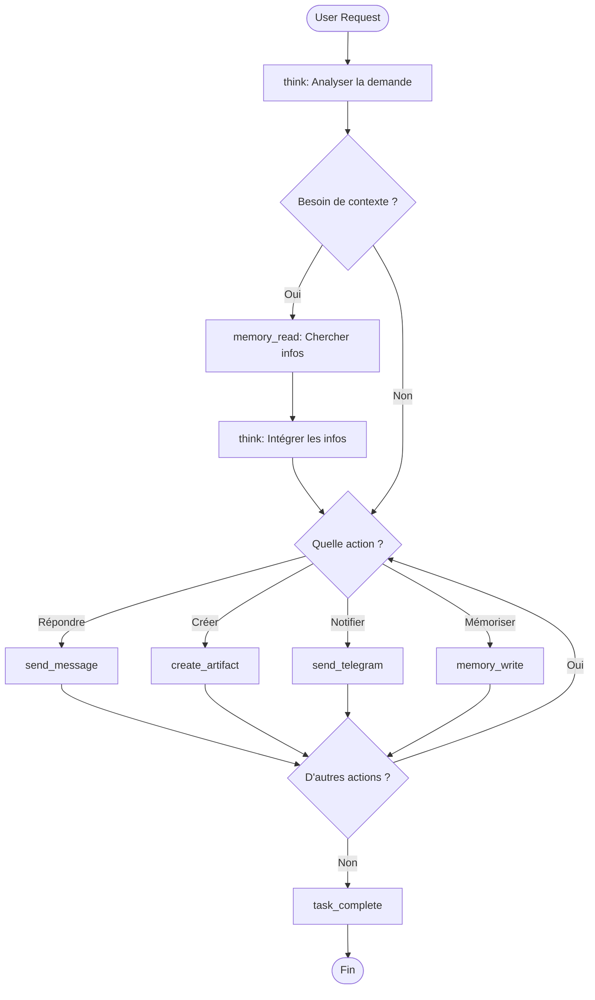

# 🤖 Point de Vue de l'IA

> Ce document décrit ce que l'IA "voit" et comment elle interagit avec le système.
> L'objectif : maximiser l'efficacité de l'IA en lui donnant les bons outils et infos.

---

## 🧠 Contexte de l'IA

Quand l'IA reçoit une requête, elle a accès à :

```
┌─────────────────────────────────────────────────────────────┐
│                    CE QUE L'IA VOIT                         │
├─────────────────────────────────────────────────────────────┤
│                                                             │
│  1. SYSTEM PROMPT (qui suis-je ?)                          │
│     └── Personnalité, règles, format de réponse            │
│                                                             │
│  2. TOOLS DISPONIBLES (que puis-je faire ?)                │
│     └── Liste des tools avec leurs descriptions            │
│                                                             │
│  3. CONVERSATION (contexte)                                 │
│     └── Messages précédents de la session                  │
│                                                             │
│  4. MEMORIES (connaissances user)                          │
│     └── Faits/préférences stockés sur l'utilisateur        │
│                                                             │
│  5. USER MESSAGE (la demande)                              │
│     └── Ce que l'utilisateur veut maintenant               │
│                                                             │
└─────────────────────────────────────────────────────────────┘
```

---

## 🔧 Les Tools : Le Pouvoir de l'IA

### Catégories de Tools

```
┌─────────────────────────────────────────────────────────────┐
│                    TOOLS DE L'IA                            │
├─────────────────┬─────────────────┬─────────────────────────┤
│  RÉFLEXION      │  COMMUNICATION  │  ACTIONS                │
│                 │                 │                         │
│  think          │  send_message   │  create_artifact        │
│  (raisonner)    │  (répondre)     │  (créer contenu)       │
│                 │                 │                         │
│                 │  send_telegram  │  memory_write           │
│                 │  send_email     │  (mémoriser)            │
│                 │                 │                         │
│                 │  task_complete  │  search_web             │
│                 │  (terminer)     │  (chercher)             │
├─────────────────┴─────────────────┴─────────────────────────┤
│  LECTURE                                                    │
│                                                             │
│  memory_read    get_weather    get_time    get_artifact    │
│  (rappeler)     (météo)        (heure)     (lire artifact) │
└─────────────────────────────────────────────────────────────┘
```

### Principe : Tools = Interface avec le Monde

L'IA ne peut **RIEN faire** sans tools. Chaque action passe par un tool :

| Action | Tool requis |
|--------|-------------|
| Répondre à l'utilisateur | `send_message` |
| Réfléchir étape par étape | `think` |
| Créer du code/HTML/doc | `create_artifact` |
| Se souvenir d'une info | `memory_write` |
| Retrouver une info | `memory_read` |
| Notifier sur Telegram | `send_telegram` |
| Terminer la tâche | `task_complete` |

---

## 📋 Format des Tools pour l'IA

### Ce que l'IA reçoit (OpenAI Function Calling format)

```json
{
  "tools": [
    {
      "type": "function",
      "function": {
        "name": "think",
        "description": "Use this tool to think step-by-step about a problem. Your thoughts will be shown to the user in a collapsible section. Use this BEFORE taking actions to plan your approach.",
        "parameters": {
          "type": "object",
          "properties": {
            "thought": {
              "type": "string",
              "description": "Your reasoning, analysis, or planning thoughts"
            }
          },
          "required": ["thought"]
        }
      }
    },
    {
      "type": "function",
      "function": {
        "name": "send_message",
        "description": "Send a message to the user. Use this for your final response or intermediate updates.",
        "parameters": {
          "type": "object",
          "properties": {
            "message": {
              "type": "string",
              "description": "The message to send to the user. Supports Markdown."
            }
          },
          "required": ["message"]
        }
      }
    },
    {
      "type": "function",
      "function": {
        "name": "memory_read",
        "description": "Search for information you previously stored about this user. Use this to recall preferences, facts, or context.",
        "parameters": {
          "type": "object",
          "properties": {
            "query": {
              "type": "string",
              "description": "What to search for in memory"
            },
            "category": {
              "type": "string",
              "enum": ["preference", "fact", "context", "all"],
              "description": "Category to search in"
            }
          },
          "required": ["query"]
        }
      }
    },
    {
      "type": "function",
      "function": {
        "name": "memory_write",
        "description": "Store important information about the user for future reference. Use this to remember preferences, facts, or important context.",
        "parameters": {
          "type": "object",
          "properties": {
            "content": {
              "type": "string",
              "description": "The information to remember"
            },
            "category": {
              "type": "string",
              "enum": ["preference", "fact", "context"],
              "description": "Category of information"
            }
          },
          "required": ["content", "category"]
        }
      }
    },
    {
      "type": "function",
      "function": {
        "name": "create_artifact",
        "description": "Create a rich artifact (HTML, code, markdown) that will be displayed in a side panel. Use for code, documents, visualizations.",
        "parameters": {
          "type": "object",
          "properties": {
            "title": {
              "type": "string",
              "description": "Title of the artifact"
            },
            "type": {
              "type": "string",
              "enum": ["html", "code", "markdown"],
              "description": "Type of content"
            },
            "content": {
              "type": "string",
              "description": "The content of the artifact"
            },
            "language": {
              "type": "string",
              "description": "Programming language (for code type)"
            }
          },
          "required": ["title", "type", "content"]
        }
      }
    },
    {
      "type": "function",
      "function": {
        "name": "task_complete",
        "description": "Signal that you have completed the user's request. Call this when you're done with ALL actions.",
        "parameters": {
          "type": "object",
          "properties": {
            "summary": {
              "type": "string",
              "description": "Brief summary of what was accomplished"
            }
          },
          "required": ["summary"]
        }
      }
    }
  ]
}
```

---

## 🔄 Workflow Typique de l'IA



### Exemple concret

**User** : "Rappelle-moi mon langage préféré et crée un Hello World"

```
1. think("L'utilisateur veut que je retrouve son langage préféré puis crée du code")

2. memory_read(query="langage préféré", category="preference")
   → Résultat: "Python"

3. think("Son langage préféré est Python, je vais créer un Hello World")

4. create_artifact(
     title="Hello World Python",
     type="code",
     language="python",
     content="print('Hello, World!')"
   )

5. send_message("Voici un Hello World dans ton langage préféré : Python! 🐍")

6. task_complete(summary="Créé Hello World Python basé sur la préférence utilisateur")
```

---

## 🎯 Optimisations pour l'IA

### 1. Descriptions claires des tools

Chaque tool doit avoir une description qui répond à :
- **QUAND** l'utiliser
- **POURQUOI** l'utiliser
- **COMMENT** l'utiliser

```python
# ❌ Mauvais
"description": "Writes to memory"

# ✅ Bon
"description": "Store important information about the user for future reference. Use this to remember preferences (like favorite language), facts (like their job), or context (like ongoing projects). This persists across conversations."
```

### 2. Catégories sémantiques

Les tools groupés par intention :

| Intention | Tools |
|-----------|-------|
| "Je veux réfléchir" | `think` |
| "Je veux communiquer" | `send_message`, `send_telegram`, `send_email` |
| "Je veux créer" | `create_artifact` |
| "Je veux me souvenir" | `memory_write` |
| "Je veux retrouver" | `memory_read`, `search_web` |
| "J'ai fini" | `task_complete` |

### 3. Mémoire structurée

Format recommandé pour `memory_write` :

```json
{
  "category": "preference",
  "content": "Langage de programmation préféré: Python"
}

{
  "category": "fact",
  "content": "Travaille chez TechCorp comme développeur senior"
}

{
  "category": "context",
  "content": "Projet en cours: refonte de l'architecture multi-agent"
}
```

### 4. Artifacts pour le contenu riche

Quand utiliser `create_artifact` vs `send_message` :

| Contenu | Tool |
|---------|------|
| Texte court, explication | `send_message` |
| Code > 10 lignes | `create_artifact` (type: code) |
| Document structuré | `create_artifact` (type: markdown) |
| Visualisation interactive | `create_artifact` (type: html) |
| Réponse conversationnelle | `send_message` |

---

## 📊 Métriques de Performance IA

### Ce qu'on veut optimiser

| Métrique | Objectif | Comment |
|----------|----------|---------|
| Pertinence | L'IA répond à la demande | Bons tools + bonnes descriptions |
| Efficacité | Minimum de tool calls | Tools bien conçus, pas de redondance |
| Mémoire | L'IA se souvient | `memory_write` systématique |
| Temps | Réponse rapide | Tools async, pas de blocage |

### Anti-patterns à éviter

| Anti-pattern | Problème | Solution |
|--------------|----------|----------|
| Tool trop générique | L'IA ne sait pas quand l'utiliser | Descriptions précises |
| Tool trop spécifique | Jamais utilisé | Fusionner avec un autre |
| Paramètres obscurs | Mauvaise utilisation | Descriptions + exemples |
| Pas de `task_complete` | Boucle infinie | Toujours terminer |

---

## 🔮 Tools Recommandés (Liste Complète)

### Core (obligatoires)
- `think` - Raisonnement
- `send_message` - Communication
- `task_complete` - Terminaison

### Memory (recommandés)
- `memory_read` - Lecture mémoire
- `memory_write` - Écriture mémoire

### Artifacts (recommandés)
- `create_artifact` - Création
- `edit_artifact` - Modification
- `get_artifact` - Lecture

### Communication externe (optionnels)
- `send_telegram` - Notification Telegram
- `send_email` - Notification Email
- `send_discord` - Notification Discord

### Utilitaires (optionnels)
- `search_web` - Recherche web
- `get_weather` - Météo
- `get_time` - Heure actuelle
- `calculate` - Calculs

---

## 🧪 Test : L'IA voit-elle bien ?

Pour vérifier que l'IA a ce qu'il faut :

```python
# Test 1 : L'IA peut-elle réfléchir ?
assert "think" in tools

# Test 2 : L'IA peut-elle répondre ?
assert "send_message" in tools

# Test 3 : L'IA peut-elle terminer ?
assert "task_complete" in tools

# Test 4 : L'IA peut-elle se souvenir ?
assert "memory_write" in tools and "memory_read" in tools

# Test 5 : Les descriptions sont-elles claires ?
for tool in tools:
    assert len(tool.description) > 50  # Assez descriptif
    assert "Use this" in tool.description  # Explique quand utiliser
```

---

## 📝 Template de Tool Optimisé

```python
"""
Tool: {nom}
Category: {reflexion|communication|action|lecture}
"""

def get_definition() -> dict:
    return {
        "type": "function",
        "function": {
            "name": "{nom}",
            "description": """
{Une phrase qui dit CE QUE fait le tool.}
Use this when {QUAND l'utiliser}.
{Exemple d'utilisation si utile.}
""".strip(),
            "parameters": {
                "type": "object",
                "properties": {
                    "{param1}": {
                        "type": "string",
                        "description": "{Description claire du paramètre}"
                    }
                },
                "required": ["{param1}"]
            }
        }
    }

def execute(**args) -> dict:
    # Logique du tool
    return {"success": True, "result": "..."}

def to_event(args: dict, result: dict) -> dict | None:
    # Optionnel : convertir en LogEvent
    return {"type": "{event_type}", "data": {...}}

def is_terminal() -> bool:
    # True si ce tool termine la boucle
    return False
```
