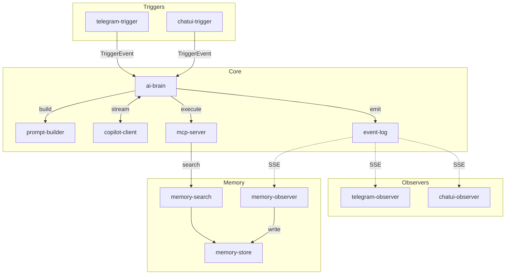

# 🔬 Analyse des Séparations de Services

> Réflexion sur les services qui pourraient être encore séparés.

---

## 1️⃣ Memory : Une Interface comme les autres ?

### Observation
Tu as raison : `memory` ressemble à une interface !
- Elle **observe** event-log (comme telegram-observer)
- Elle **stocke** des données (comme un sender stocke vers l'extérieur)
- Elle **répond** à des requêtes (search)

### Comparaison

| Composant | Telegram | Memory |
|-----------|----------|--------|
| Trigger | Reçoit message Telegram | ❌ N/A (pas de trigger externe) |
| Observer | Écoute `send_telegram` | Écoute `memory_write` |
| Sender/Store | Envoie via API Telegram | Stocke dans SQLite |
| + Extra | - | Expose `/search` (lecture) |

### Proposition : 3 services pour Memory

```
core/memory/
├── store/           # Stockage CRUD
│   ├── main.py      # POST /write, GET /read
│   └── database.py  # SQLite
│
├── search/          # Recherche sémantique
│   ├── main.py      # POST /search
│   └── embeddings.py # (futur: vectoriel)
│
└── observer/        # Écoute event-log
    ├── main.py      # SSE → filtre memory_write → store
    └── ...
```

### Flow

```
ai-brain ──emit memory_write──► event-log
                                    │
                    ┌───────────────┘
                    ▼
            memory-observer ──► memory-store (write)
                    
mcp-server ──memory_read tool──► memory-search ──► memory-store (read)
```

### Bénéfices
| Avant | Après |
|-------|-------|
| 1 service qui fait 3 choses | 3 services avec 1 responsabilité |
| Difficile de changer le stockage | Remplacer `store` par Postgres = 1 service |
| Difficile d'ajouter vectoriel | Ajouter dans `search` sans toucher le reste |

---

## 2️⃣ Event-Log : Store + Stream

### Ce que fait event-log actuellement

1. **Recevoir** les LogEvents (POST /events)
2. **Stocker** dans SQLite (append-only)
3. **Streamer** via SSE (GET /stream)

### Faut-il séparer ?

| Option | Pour | Contre |
|--------|------|--------|
| **Garder ensemble** | Simple, même DB | Couplage store/stream |
| **Séparer** | Isolation pure | Over-engineering ? |

### Analyse

```
POST /events  ──►  SQLite  ──►  GET /stream
     │                              │
     └──────── MÊME DB ─────────────┘
```

Le store et le stream utilisent la **même base de données**. Les séparer impliquerait :
- Soit partager le volume SQLite (pas propre)
- Soit avoir 2 DBs synchronisées (complexe)
- Soit stream en mémoire seulement (perd la persistence)

### Verdict : ❌ Ne pas séparer

Event-log est un cas où le stockage ET le streaming sont intrinsèquement liés. C'est comme une base de données avec son API - on ne sépare pas PostgreSQL de son protocole réseau.

**Exception** : Si on migrait vers un vrai event store (Kafka, EventStoreDB), alors la séparation serait naturelle.

---

## 3️⃣ Prompt-Builder : Service dédié ?

### Ce que ferait prompt-builder

```python
# Entrée
{
  "user_message": "Crée un site web",
  "conversation_history": [...],
  "user_memories": [...],
  "available_tools": [...],
  "source": "telegram"
}

# Sortie
{
  "messages": [
    {"role": "system", "content": "Tu es un assistant..."},
    {"role": "user", "content": "...contexte..."},
    {"role": "user", "content": "Crée un site web"}
  ]
}
```

### Responsabilités

| Tâche | Description |
|-------|-------------|
| System prompt | Générer le prompt système selon le contexte |
| Injection mémoire | Ajouter les memories pertinentes |
| Formatage conversation | Structurer l'historique |
| Adaptation interface | Prompts différents selon telegram/chat-ui |
| Instructions source | Ajouter les instructions du trigger |

### Bénéfices

1. **Testable isolément** : Tester les prompts sans l'IA
2. **Itérable** : Changer les prompts sans toucher ai-brain
3. **A/B testing** : Tester différentes versions de prompts
4. **Spécialisable** : Prompts différents par interface

### Structure proposée

```
core/prompt-builder/
├── main.py           # FastAPI POST /build
├── templates/        # Templates de prompts
│   ├── system.py     # Prompt système de base
│   ├── telegram.py   # Adaptations Telegram
│   ├── chat_ui.py    # Adaptations Chat-UI
│   └── email.py      # Adaptations Email
├── injectors/        # Plugins d'injection
│   ├── memory.py     # Injecte les memories
│   ├── history.py    # Injecte l'historique
│   └── tools.py      # Injecte la liste des tools
└── requirements.txt
```

### Contrat

```python
@app.post("/build")
async def build_prompt(request: PromptRequest) -> PromptResponse:
    """
    Construit le prompt complet pour l'IA
    
    Input:
    - user_message: str
    - source: str (telegram, chat_ui, email)
    - session_id: str
    - user_id: str
    
    Output:
    - messages: list[Message]
    - metadata: dict (debug info)
    """
```

### Verdict : ✅ Bonne idée

Séparer le prompt-builder permet de :
- Itérer sur les prompts sans risquer la boucle
- Tester les prompts en isolation
- Avoir des prompts spécialisés par interface

---

## 4️⃣ Gateway devant AI-Brain ?

### Ce que ferait un gateway

```
Trigger ──► Gateway ──► AI-Brain
               │
               ├── Auth / Rate limit
               ├── Validation du TriggerEvent
               ├── Load balancing (si multiple ai-brain)
               └── Logging / Metrics
```

### Faut-il le faire ?

| Pour | Contre |
|------|--------|
| Auth centralisée | Prématuré (pas d'auth V1) |
| Rate limiting | Peut être dans ai-brain |
| Metrics | Peut être dans ai-brain |
| Load balancing | 1 seul ai-brain pour l'instant |

### Verdict : ❌ Pas maintenant

Un gateway serait utile si :
- Multiple instances de ai-brain
- Auth complexe
- Rate limiting sophistiqué

Pour la V1, c'est de l'over-engineering. Les triggers envoient directement à ai-brain.

**À reconsidérer** quand on aura besoin de scaling horizontal.

---

## 📊 Résumé des décisions

| Service | Séparer ? | Justification |
|---------|-----------|---------------|
| **memory** | ✅ OUI (3 services) | store + search + observer = 3 responsabilités |
| **event-log** | ❌ NON | Store et stream partagent la même DB |
| **prompt-builder** | ✅ OUI | Testable, itérable, spécialisable |
| **gateway** | ❌ NON (V1) | Prématuré, pas de besoin actuel |

---

## 🏗️ Architecture Finale Mise à Jour

### Core Services (7)

| Service | Port | Responsabilité |
|---------|------|----------------|
| `ai-brain` | 8080 | Orchestration boucle |
| `copilot-client` | 8081 | Connexion LLM |
| `mcp-server` | 8082 | Exécution tools |
| `prompt-builder` | 8083 | Construction prompts |
| `event-log` | 8085 | Stockage + streaming events |
| `memory-store` | 8086 | CRUD mémoire |
| `memory-search` | 8087 | Recherche mémoire |

### Memory Observer = Interface

```
interfaces/memory/
└── observer/
    ├── main.py          # Écoute memory_write → appelle memory-store
    └── requirements.txt
```

Pas de trigger (pas d'input externe) ni de sender (pas d'output externe).

### Formule mise à jour

```
Total = 7 (core) + 1 (memory-observer) + 3 × N (interfaces)

Avec Telegram + Chat-UI :
= 7 + 1 + (3 × 2) = 14 containers
```

---

## 🔄 Nouveau Flow


