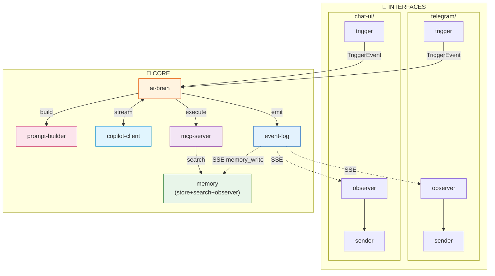

# 🔄 Révision Architecture - Clarifications

## Questions et Réponses

### Q1 : Event-Log - Pourquoi ne pas séparer Store et Stream ?

**Ce que "séparer" voudrait dire :**

```
┌─────────────────┐     ┌─────────────────┐
│  event-store    │     │  event-stream   │
│  POST /events   │────►│  GET /stream    │
│  (écrit SQLite) │     │  (lit SQLite)   │
└─────────────────┘     └─────────────────┘
        │                       │
        └───────┬───────────────┘
                ▼
           SQLite DB
           (partagée)
```

**Problèmes :**
1. **Même DB** : Les deux services accèdent au même fichier SQLite
2. **Conflits** : Écriture et lecture concurrentes = risques
3. **Synchronisation** : Comment stream sait qu'un nouveau event est arrivé ?

**Solution classique pour séparer :** Message queue (Redis, RabbitMQ)
```
event-store ──► Redis PubSub ──► event-stream
                    │
                    └──► SQLite (backup)
```

Mais c'est over-engineering pour notre cas.

**Conclusion : Garder event-log comme 1 service**
- `POST /events` : Écrit en DB + notifie les streams actifs
- `GET /stream` : SSE qui écoute les notifications

---

### Q2 : Prompt-Builder - Que fait-il EXACTEMENT ?

#### Responsabilité
> Transformer un `TriggerEvent` + contexte en `messages[]` pour le LLM

#### Input
```python
class PromptRequest(BaseModel):
    source: str              # "telegram", "chat_ui"
    user_id: str
    user_message: str
    conversation_history: list[Message]  # Derniers messages
    user_memories: list[Memory]          # Faits/préférences
    trigger_instructions: str | None     # Instructions custom
```

#### Output
```python
class PromptResponse(BaseModel):
    messages: list[Message]  # Prêt pour le LLM
    metadata: dict           # Debug info
```

#### Exemple concret

**Input :**
```json
{
  "source": "telegram",
  "user_id": "123",
  "user_message": "Quel temps fait-il ?",
  "conversation_history": [
    {"role": "user", "content": "Salut"},
    {"role": "assistant", "content": "Bonjour ! Comment puis-je t'aider ?"}
  ],
  "user_memories": [
    {"category": "preference", "content": "Habite à Paris"},
    {"category": "preference", "content": "Préfère les réponses courtes"}
  ],
  "trigger_instructions": null
}
```

**Output :**
```json
{
  "messages": [
    {
      "role": "system",
      "content": "Tu es un assistant personnel intelligent.\n\nRègles:\n- Réponds de manière concise\n- Utilise les tools disponibles\n- Termine avec task_complete\n\nContexte utilisateur:\n- Habite à Paris\n- Préfère les réponses courtes"
    },
    {
      "role": "user",
      "content": "Salut"
    },
    {
      "role": "assistant", 
      "content": "Bonjour ! Comment puis-je t'aider ?"
    },
    {
      "role": "user",
      "content": "Quel temps fait-il ?"
    }
  ],
  "metadata": {
    "memories_injected": 2,
    "history_messages": 2,
    "template_used": "default"
  }
}
```

#### Ce que prompt-builder NE fait PAS
- ❌ Appeler le LLM
- ❌ Exécuter des tools
- ❌ Stocker quoi que ce soit
- ❌ Gérer les tokens/auth

#### Pourquoi c'est utile de séparer ?
| Avantage | Explication |
|----------|-------------|
| **Tests** | Tester les prompts sans LLM (mock) |
| **Itération** | Modifier prompts sans toucher la loop |
| **A/B Test** | Comparer versions de prompts |
| **Debug** | Voir exactement ce que le LLM reçoit |
| **Spécialisation** | Prompts différents par source |

---

### Q3 : Memory - Comment restructurer ?

#### Problème actuel
```
core/
├── memory-store/    # CRUD
└── memory-search/   # Recherche

interfaces/
└── memory/
    └── observer/    # Écoute event-log → écrit dans store
```

Memory est éclaté entre core et interfaces. C'est incohérent.

#### Analyse : Memory est-il une interface ?

| Critère | Interface standard | Memory |
|---------|-------------------|--------|
| Reçoit input externe | ✅ Webhook/API | ❌ Reçoit des events internes |
| Envoie vers externe | ✅ Telegram API | ❌ Écrit en local |
| Pattern trigger/observer/sender | ✅ | ❌ Juste observer |

**Conclusion : Memory n'est PAS une interface, c'est un service core**

#### Solution : Memory = 1 service core

```
core/memory/
├── Dockerfile
├── requirements.txt
├── main.py           # FastAPI
├── store.py          # CRUD (write/read)
├── search.py         # Recherche (query)
├── observer.py       # Background task: écoute event-log
└── database.py       # SQLite
```

**Endpoints :**
- `POST /write` - Écrire une mémoire
- `GET /read/{id}` - Lire une mémoire
- `POST /search` - Rechercher
- `GET /health` - Status (inclut observer status)

**Observer intégré :**
```python
# main.py
@app.on_event("startup")
async def startup():
    asyncio.create_task(observe_event_log())

async def observe_event_log():
    """Background task qui écoute event-log pour memory_write"""
    async with httpx.AsyncClient() as client:
        async with client.stream("GET", f"{EVENT_LOG_URL}/stream?type=memory_write") as response:
            async for line in response.aiter_lines():
                if line.startswith("data:"):
                    event = json.loads(line[5:])
                    await write_memory(event["data"])
```

#### Avantages
1. **Cohérent** : Memory entièrement dans core/
2. **Simple** : 1 service au lieu de 3
3. **Logique** : L'observer est un détail d'implémentation, pas un service

---

## 🏗️ Architecture Révisée

### Core Services (6)

| Service | Port | Responsabilité |
|---------|------|----------------|
| `ai-brain` | 8080 | Orchestration boucle agentique |
| `copilot-client` | 8081 | Connexion LLM (token, streaming) |
| `mcp-server` | 8082 | Exécution tools (plugins) |
| `prompt-builder` | 8083 | Construction des prompts |
| `event-log` | 8085 | Stockage + streaming events |
| `memory` | 8086 | CRUD + Search + Observer interne |

### Interfaces (3 par canal)

```
interfaces/
├── telegram/     (trigger + observer + sender)
├── chat-ui/      (trigger + observer + sender)
└── email/        (trigger + observer + sender)
```

**Note : Plus de `interfaces/memory/`** - Memory est dans core.

### Formule containers
```
Total = 6 (core) + 3 × N (interfaces)

Avec Telegram + Chat-UI :
= 6 + 6 = 12 containers
```

---

## 📊 Comparaison

| Aspect | Avant (V2.2) | Après (V2.3) |
|--------|--------------|--------------|
| Core services | 7 | 6 |
| Memory services | 3 (store + search + observer) | 1 |
| Memory dans interfaces | ✅ Oui (observer) | ❌ Non |
| Cohérence | ⚠️ Memory éclaté | ✅ Memory unifié |
| Complexité | Plus élevée | Réduite |

---

## 🔄 Nouveau Diagramme


