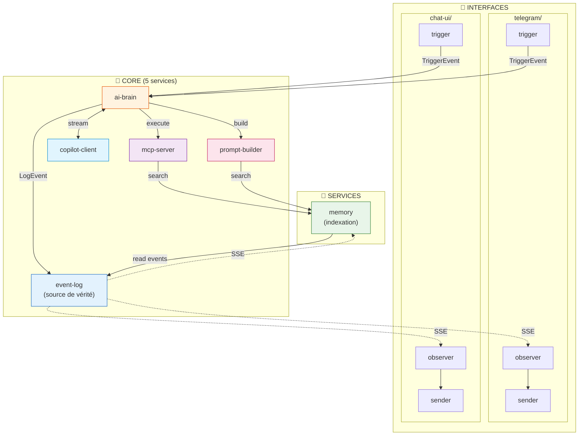

# 🏆 Architecture V3 - Version Finale

> **Document de référence unique** - Décembre 2024
> 
> Cette version simplifie memory : plus de duplication, juste une couche d'indexation sur event-log.

---

## 🔍 Évolution de l'Architecture

| Version | Changement |
|---------|------------|
| V1 | Monolithe copilot-proxy |
| V2.0 | Séparation en 3 core services |
| V2.1 | Séparation en 5 core services |
| V2.2 | Séparation en 7 core services (memory split) |
| V2.3 | Consolidation à 6 core (memory unifié) |
| **V3.0** | **5 core + memory séparé (indexation sur event-log)** |

---

## 💡 Insight Clé : Pas de Duplication

**Avant** : event-log stocke les events ET memory stocke les mémoires → duplication

**Maintenant** : 
- `event-log` = source de vérité (stocke TOUT)
- `memory` = couche d'indexation/recherche (lit event-log, ne stocke rien de plus)

```
event-log contient déjà:
├── Conversations (type: message, message_delta)
├── Tool calls (type: tool_call, tool_result)
├── Mémoires explicites (type: memory_write)
├── Artifacts (type: artifact, artifact_edit)
└── Tout le reste...

memory fait juste:
├── Indexer les events pertinents
├── Créer des embeddings pour recherche sémantique
└── Exposer POST /search pour l'IA
```

---

## 🧱 Architecture Finale



---

## 📊 Résumé des Services

| Catégorie | Services | Containers |
|-----------|----------|------------|
| **Core** | ai-brain, copilot-client, mcp-server, prompt-builder, event-log | 5 |
| **Services** | memory | 1 |
| **Telegram** | trigger, observer, sender | 3 |
| **Chat-UI** | trigger, observer, sender | 3 |
| **Total (exemple)** | | **12** |

### Formule :
```
Total = 5 (core) + 1 (memory) + 3 × N (interfaces)

Exemple avec 2 interfaces :
= 5 + 1 + (3 × 2) = 12 containers
```

---

## 🎯 Responsabilités

### Core (5 services)

| Service | Port | Responsabilité UNIQUE |
|---------|------|----------------------|
| `ai-brain` | 8080 | Orchestration boucle agentique |
| `copilot-client` | 8081 | Connexion GitHub Copilot (token, streaming) |
| `mcp-server` | 8082 | Exécution des tools (plugins) |
| `prompt-builder` | 8083 | Construction des prompts |
| `event-log` | 8085 | **Stockage unique de TOUT** (source de vérité) |

### Services (1 pour l'instant)

| Service | Port | Responsabilité |
|---------|------|----------------|
| `memory` | 8084 | Indexation + recherche sur event-log |

> **Note** : `memory` n'est ni core ni interface. C'est un service auxiliaire qui sera implémenté en dernier.

### Interfaces (3 par canal)

| Type | Responsabilité |
|------|----------------|
| `trigger` | Recevoir input externe → TriggerEvent → ai-brain |
| `observer` | Écouter event-log SSE → appeler sender |
| `sender` | Envoyer message vers service externe |

---

## 📁 Structure des Fichiers

```
multi_agent/
│
├── core/                              # 🧠 Services centraux (5)
│   │
│   ├── ai-brain/                      # 🎯 Orchestration
│   │   ├── Dockerfile
│   │   ├── requirements.txt
│   │   ├── main.py                    # FastAPI + POST /process
│   │   ├── loop.py                    # Boucle agentique
│   │   └── event_emitter.py           # Envoie vers event-log
│   │
│   ├── copilot-client/                # 🤖 Connexion LLM
│   │   ├── Dockerfile
│   │   ├── requirements.txt
│   │   ├── main.py                    # FastAPI + POST /stream
│   │   ├── copilot.py                 # Token auth + refresh
│   │   └── streaming.py               # SSE streaming
│   │
│   ├── mcp-server/                    # 🔧 Exécution tools
│   │   ├── Dockerfile
│   │   ├── requirements.txt
│   │   ├── main.py                    # FastAPI + GET /tools + POST /execute
│   │   └── tools/                     # 🔌 PLUGINS
│   │       ├── __init__.py
│   │       ├── think.py
│   │       ├── send_message.py
│   │       ├── recall.py              # Appelle memory/search
│   │       ├── remember.py            # Émet memory_write → event-log
│   │       ├── create_artifact.py
│   │       ├── send_telegram.py
│   │       └── task_complete.py
│   │
│   ├── prompt-builder/                # 📝 Construction prompts
│   │   ├── Dockerfile
│   │   ├── requirements.txt
│   │   ├── main.py                    # FastAPI + POST /build
│   │   └── templates/
│   │       ├── system.py
│   │       ├── telegram.py
│   │       └── chat_ui.py
│   │
│   └── event-log/                     # 📋 Source de vérité
│       ├── Dockerfile
│       ├── requirements.txt
│       ├── main.py                    # POST /events + GET /stream + GET /query
│       └── database.py
│       #
│       # Endpoints:
│       #   POST /events         - Ajouter un event
│       #   GET  /stream         - SSE stream (avec filtres)
│       #   GET  /query          - Requêtes (par session, user, type, etc.)
│       #   GET  /sessions/:id   - Historique d'une session
│
├── services/                          # 🔧 Services auxiliaires
│   │
│   └── memory/                        # 🧠 Indexation + recherche
│       ├── Dockerfile
│       ├── requirements.txt
│       ├── main.py                    # FastAPI + POST /search
│       ├── indexer.py                 # Crée embeddings des events
│       └── observer.py                # Écoute event-log pour indexer en temps réel
│       #
│       # Ce service:
│       #   1. Écoute event-log SSE (types: memory_write, message, etc.)
│       #   2. Crée des embeddings pour recherche sémantique
│       #   3. Stocke les embeddings (pas les données brutes!)
│       #   4. Expose POST /search qui cherche dans ses index
│       #      puis récupère les events depuis event-log
│
├── interfaces/                        # 📱 Canaux de communication
│   │
│   ├── _base/
│   │   └── Dockerfile.template
│   │
│   ├── telegram/
│   │   ├── trigger/
│   │   ├── observer/
│   │   └── sender/
│   │
│   └── chat-ui/
│       ├── trigger/
│       ├── observer/
│       └── sender/
│
├── shared/
│   ├── models.py
│   └── config.py
│
├── docker-compose.yml
└── .env
```

---

## 🗄️ Base de Données

### event-log (LA SEULE BASE)

```sql
CREATE TABLE events (
    id TEXT PRIMARY KEY,
    type TEXT NOT NULL,
    session_id TEXT NOT NULL,
    user_id TEXT,
    source TEXT,
    data JSON NOT NULL,
    created_at TIMESTAMP DEFAULT CURRENT_TIMESTAMP
);

-- Index pour les requêtes fréquentes
CREATE INDEX idx_session ON events(session_id);
CREATE INDEX idx_user ON events(user_id);
CREATE INDEX idx_type ON events(type);
CREATE INDEX idx_created ON events(created_at);
```

### memory (JUSTE DES INDEX)

```sql
-- Stocke uniquement les embeddings, pas les données
CREATE TABLE embeddings (
    id TEXT PRIMARY KEY,
    event_id TEXT NOT NULL,        -- Référence vers event-log
    embedding BLOB NOT NULL,        -- Vecteur pour recherche sémantique
    created_at TIMESTAMP DEFAULT CURRENT_TIMESTAMP
);

CREATE INDEX idx_event_id ON embeddings(event_id);
```

**Important** : Quand memory fait une recherche :
1. Cherche dans `embeddings` (similarité vectorielle)
2. Récupère les `event_id` correspondants
3. Fetch les events complets depuis `event-log` via `GET /query?ids=...`

---

## 🐳 docker-compose.yml

```yaml
version: '3.8'

services:
  # === CORE (5 services) ===
  ai-brain:
    build: ./core/ai-brain
    ports: ["8080:8080"]
    environment:
      - COPILOT_CLIENT_URL=http://copilot-client:8081
      - MCP_SERVER_URL=http://mcp-server:8082
      - PROMPT_BUILDER_URL=http://prompt-builder:8083
      - EVENT_LOG_URL=http://event-log:8085
    depends_on:
      - copilot-client
      - mcp-server
      - prompt-builder
      - event-log

  copilot-client:
    build: ./core/copilot-client
    ports: ["8081:8081"]
    environment:
      - COPILOT_TOKEN=${COPILOT_TOKEN}

  mcp-server:
    build: ./core/mcp-server
    ports: ["8082:8082"]
    environment:
      - MEMORY_URL=http://memory:8084
      - EVENT_LOG_URL=http://event-log:8085

  prompt-builder:
    build: ./core/prompt-builder
    ports: ["8083:8083"]
    environment:
      - MEMORY_URL=http://memory:8084
      - EVENT_LOG_URL=http://event-log:8085

  event-log:
    build: ./core/event-log
    ports: ["8085:8085"]
    volumes:
      - event_data:/app/data

  # === SERVICES (1) ===
  memory:
    build: ./services/memory
    ports: ["8084:8084"]
    environment:
      - EVENT_LOG_URL=http://event-log:8085
    volumes:
      - memory_index:/app/data
    depends_on:
      - event-log

  # === TELEGRAM (3 services) ===
  telegram-trigger:
    build:
      context: ./interfaces/telegram/trigger
      dockerfile: ../../_base/Dockerfile.template
    environment:
      - TELEGRAM_BOT_TOKEN=${TELEGRAM_BOT_TOKEN}
      - AI_BRAIN_URL=http://ai-brain:8080

  telegram-observer:
    build:
      context: ./interfaces/telegram/observer
      dockerfile: ../../_base/Dockerfile.template
    environment:
      - EVENT_LOG_URL=http://event-log:8085
      - SENDER_URL=http://telegram-sender:8000
    depends_on:
      - event-log

  telegram-sender:
    build:
      context: ./interfaces/telegram/sender
      dockerfile: ../../_base/Dockerfile.template
    environment:
      - TELEGRAM_BOT_TOKEN=${TELEGRAM_BOT_TOKEN}

  # === CHAT-UI (3 services) ===
  chatui-trigger:
    build:
      context: ./interfaces/chat-ui/trigger
      dockerfile: ../../_base/Dockerfile.template
    ports: ["3001:8000"]
    environment:
      - AI_BRAIN_URL=http://ai-brain:8080

  chatui-observer:
    build:
      context: ./interfaces/chat-ui/observer
      dockerfile: ../../_base/Dockerfile.template
    ports: ["3002:8000"]
    environment:
      - EVENT_LOG_URL=http://event-log:8085
      - SENDER_URL=http://chatui-sender:8000
    depends_on:
      - event-log

  chatui-sender:
    build:
      context: ./interfaces/chat-ui/sender
      dockerfile: ../../_base/Dockerfile.template
    ports: ["3000:8000"]

volumes:
  event_data:
  memory_index:
```

---

## 🔄 Flow Complet

### 1. Utilisateur envoie un message

```
[Telegram] → telegram-trigger → TriggerEvent → ai-brain
```

### 2. AI Brain orchestre

```
ai-brain:
  1. POST prompt-builder/build (avec context)
  2. POST copilot-client/stream (streaming LLM)
  3. Pour chaque tool_call:
     POST mcp-server/execute
  4. POST event-log/events (log tout)
  5. Boucle jusqu'à task_complete ou send_message
```

### 3. Tool "remember" (écrire mémoire)

```
mcp-server.execute("remember", {content: "..."})
  → Émet LogEvent type="memory_write"
  → ai-brain POST event-log/events

memory (observer en background):
  → Reçoit SSE type="memory_write"
  → Crée embedding
  → Stocke dans embeddings table
```

### 4. Tool "recall" (lire mémoire)

```
mcp-server.execute("recall", {query: "..."})
  → POST memory/search
  
memory:
  → Recherche sémantique dans embeddings
  → GET event-log/query?ids=e1,e2,e3
  → Retourne les events complets
```

### 5. Message envoyé à l'utilisateur

```
ai-brain:
  → POST event-log/events (type="send_telegram")

telegram-observer:
  → Reçoit SSE type="send_telegram"
  → POST telegram-sender/send
  
telegram-sender:
  → Appelle API Telegram
```

---

## 🎯 Avantages de cette Architecture

### 1. Pas de duplication
- `event-log` = seule source de vérité
- `memory` = juste des index/embeddings

### 2. Reconstruction possible
- Si on perd `memory`, on peut reconstruire les embeddings depuis `event-log`
- Les données brutes sont toujours dans `event-log`

### 3. Flexibilité
- On peut changer l'algorithme d'embedding sans perdre de données
- On peut ajouter d'autres types d'index plus tard

### 4. Simplicité
- 5 services core clairement définis
- `memory` comme service optionnel/auxiliaire

---

## ✅ Ordre d'Implémentation

### Phase 1 : Core (sans memory)
1. [ ] `event-log` - Stockage + streaming + query
2. [ ] `copilot-client` - Connexion LLM
3. [ ] `mcp-server` - Tools (sans recall/remember)
4. [ ] `prompt-builder` - Prompts
5. [ ] `ai-brain` - Orchestration

### Phase 2 : Interfaces
6. [ ] `interfaces/telegram/` - trigger, observer, sender
7. [ ] `interfaces/chat-ui/` - trigger, observer, sender

### Phase 3 : Memory (à la fin)
8. [ ] `services/memory` - Indexation + recherche
9. [ ] Tools `recall` et `remember`

---

## 📝 Notes

- **Memory est optionnel** : Le système fonctionne sans, juste sans mémoire à long terme
- **event-log contient tout** : Conversations, artifacts, tool calls, mémoires explicites
- **Memory ne duplique pas** : Juste des embeddings qui pointent vers event-log
